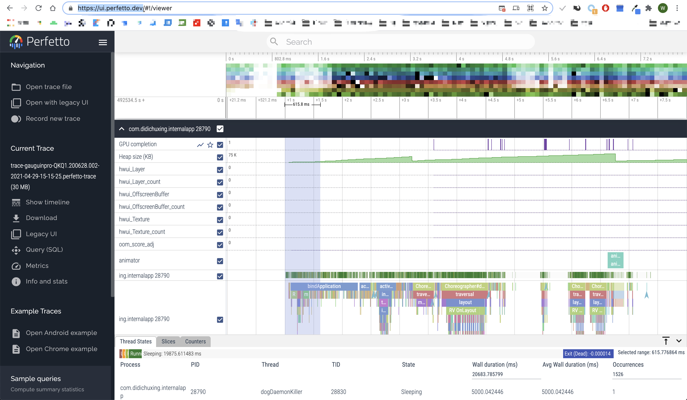
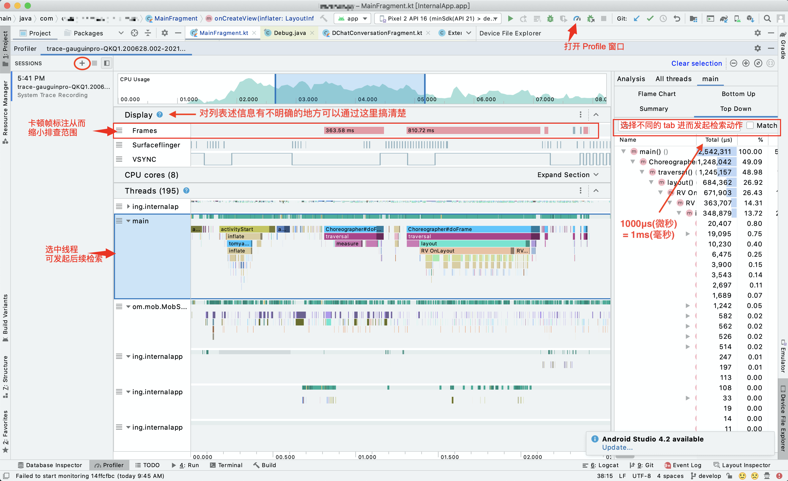
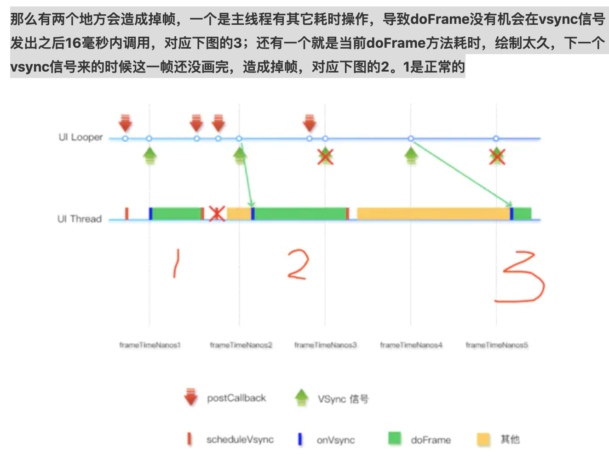

# Android 性能优化 ☞ 卡顿

本文内容可以通过通篇阅读官方文档完全获取 , 本文是按照个人思路做的流程化的笔记📒 .
所涉及的连接如下:
1. 渲染速度缓慢 : https://developer.android.google.cn/topic/performance/vitals/render?hl=zh-cn
2. 在命令行上捕获系统跟踪记录 : https://developer.android.google.cn/topic/performance/tracing/command-line?hl=zh-cn
3. 捕获设备上的系统跟踪记录 : https://developer.android.com/topic/performance/tracing/on-device?hl=zh-cn
4. 浏览 Systrace 报告: https://developer.android.com/topic/performance/tracing/navigate-report?hl=zh-cn
5. 


## 0x01. [什么是卡顿以及卡顿的检测方法枚举](https://developer.android.google.cn/topic/performance/vitals/render?hl=zh-cn)

界面呈现是指从应用生成帧并将其显示在屏幕上的动作。要确保用户能够流畅地与您的应用互动，您的应用呈现每帧的时间不应超过 16ms，以达到每秒 60 帧的呈现速度。如果您的应用存在界面呈现缓慢的问题，系统会不得不跳过一些帧，这会导致用户感觉您的应用不流畅。我们将这种情况称为**卡顿**。

- 目视检查方法
- **Systrace 方法**
- 自定义性能监控方法


## 0x02. Systrace(System Trace) : 系统跟踪方法

小节摘要 : Systrace 工具通过跟踪系统的各项资源指标输出一个跟踪文件(我们称为`trace文件`) , 然后通过相应的图形界面解析工具(Perfetto/SystraceHTML)将跟踪文件转换为可视可分析的报表(**推荐 -3-**)
1. Perfetto : 是一个将 `trace文件` 转换为可视化报表的工具 : https://ui.perfetto.dev/
    - 
2. SystraceHTML : 这个名字是个人杜撰出来的 , 没有这个名字 , 这个工具展示出来的 UI 当前已经是`旧用户界面` 了 , 可以通过 Perfetto 工具的 `Legacy UI` 来生成`旧用户界面`
3. 可以通过 AndroidStudio Profile 打开`trace文件` , 选择进程的时候我选择了 默认的那个 `re-initialized>` 可用 : 这个跟 `Perfetto` 相比 :
    - 这个跟 `Perfetto` 相比选中目标线程后才可以使用检索能力 ; 检索内容可以是 `Trace.beginSection` 函数打的标签也可以是其他内容
    - 但是通过肉眼找到目标`Slices(色块/切片)`的时候 , 是可以列举出子`Slices(色块/切片)`所对应的层级关系的(可折叠)
    - 可以查看 Frames(帧) 耗时 
    - 二者都可以查看某一个函数的耗时 , 但是 AndroidStudio 列表的形式更直观些

生成`trace文件`的方式有二
1. [命令行方式](https://developer.android.google.cn/topic/performance/tracing/command-line?hl=zh-cn)
2. **此次采用的方式** : [API>=28/Android9及之上的版本可以通过系统内建的工具生成 `trace文件`](https://developer.android.com/topic/performance/tracing/on-device?hl=zh-cn)


## 0x03. 进一步定位已知问题

当我们知道某个函数或者某个类有卡顿状况的时候通过以下操作可以缩小限定范围

`trace文件`生成后就要将其以可视化的方式展示出来
- 推荐 : AndroidStudio -> Profile -> `➕`Start new profiling session -> load from file
    - 需要将 `trace文件` 设置扩展名未 `.trace`
- 不推荐 : Perfetto -> open trace file


时间轴上的条状色块是各个 label 对应的执行时间 , 但是如果没有打自定义 label 的话 , 那些 label 都是系统默认打的;

如果是假设某一部分有卡顿想要通过这个工具验证这个假设是否成立 , 我们可以打自定义标签:
```kotlin
Trace.beginSection("HelloWorld")
//other code
Trace.endSection()
```

确保生成 `trace文件` 的过程中打标签的代码被执行 , 当 Perfetto 将 `trace文件` 可视化后就可以通过搜索标签 `HelloWorld` 来定位自己标签对应的Slices(色块/切片) , 通过观察这个Slices(色块/切片)的长度是否大于 16ms 即可判断是否卡顿
- 对于`Android Studio Profile` : 需要先锁定目标线程 , 一般就是 Main 线程再发起搜索
- 对于`Perfetto` : 注意这里提到的检索不是浏览器的检索功能 , 是这个网页内部的检索功能

再继续沿着Slices(色块/切片)深入其子Slices(色块/切片)即可确定到是那些类的加载或者执行导致的时间大幅消耗 , 从而做出优化

## 0x04. 可否直接通过这种方式确定卡顿瓶颈呢? 

### 4.1. AndroidStudio Profile 比较直观的列出了卡顿帧

通过 卡顿帧 结合时间线继续向下缩小卡顿排查范围 如果有必要 可以结合代码进一步定位:
```kotlin
Trace.beginSection("HelloWorld")
//other code
Trace.endSection()
```

- 


### 4.2. Perfetto 不是很直观

不知道某个页面某个功能是否存在卡顿的问题(肉眼感知不明显) , 通过 systrace 跟踪得到日志 , 再通过 Perfetto 分析跟踪记录 , 如何判断哪里有卡顿呢 ? 

很多情况下Slices(色块/切片)从上到下的排列是这样的
|||
|-----------------------|------------------------------------------------------------------------|
|Choreographer#doFrame  |           |
|traversal              |作为下层 , 表示的是上层所做的事 , 的一个细节                                  |
|measure / layout /draw |作为下层 , 表示的是上层所做的事 , 的一个细节                                  |
|RV XxxxxView           |作为下层 , 表示的是上层所做的事 , 的一个细节                                  |
|inflate                |作为下层 , 表示的是上层所做的事 , 的一个细节                                  |
|someClass              |作为下层 , 表示的是上层所做的事 , 的一个细节                                  |


## 0x05. 当开始从 View  筛查的时候

### 5.1. Android 无法应对这种情况

### 5.2. Profile 可以通过打标记完成

当开始从 View  筛查的时候常常由于频繁的放大缩小到动作导致之前分析过并得到结论的内容被忘记
1. 增加一个行 , 并设置对应的数据字符 : 操作步骤没学会 , 但是在 https://ui.perfetto.dev/ 页面中会展示 Debug 字样的按钮 , 后来我找不到了
2. 可以在顶部的时间横轴插旗

如此就可以找到相对加载时间较长的 View , 进而可以做出相应的优化


## 0x06. 上述定位的是 View 相关的耗时问题
## 0x07. 非 UI 类问题导致的耗时如何辨别

## 0x08. View 加载造成的卡顿优化

1. 尝试降低布局的层级嵌套数量
2. 嵌套数降低到无法继续降低的时候有可能仍然卡顿(布局复杂的情况) , 可以尝试[异步加载 : Asynclayoutinflater](https://developer.android.google.cn/jetpack/androidx/releases/asynclayoutinflater)
    - [其他方法](https://zhuanlan.zhihu.com/p/368555655)


## 0x09. 如何评估卡顿原因确定收益最大的优化方向


## 待研究的方法
- https://www.codenong.com/jsb5878dca21f8/
- traceView : sdk/tools/traceview
- https://github.com/JakeWharton/hugo ; 可以尝试寻找和这个库类似能力的组件


## 参考
1. [Android：通过systrace进行性能分析](https://www.cnblogs.com/blogs-of-lxl/p/10926824.html)
2. https://juejin.cn/post/6844903949560971277#heading-18
3. http://gityuan.com/2016/01/17/systrace/
4. [代码生成 trace 文件](https://cloud.tencent.com/developer/article/1014620)
5. [Android 布局优化是真的难，从入门到放弃……](https://zhuanlan.zhihu.com/p/368555655)


## 草稿暂存
```
Debug.startMethodTracing("tomyangming.trace")
Trace.beginSection("tomyangming@didiglobal.com")
Trace.endSection()
Debug.stopMethodTracing()
```