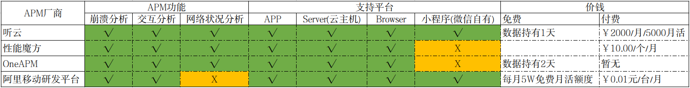

# APM 技术 调研

## 0x00. 概述
1. APM 是什么
   * APM 被设计用于解决什么问题(为什么存在)
2. APM 领域当前情况
   * 当前 APM 有那些, 看好那些
   * APM 提供的服务都有什么
3. APM 的实现在主要技术方面有那些内容/挑战
4. APM 在应用开发运营流程中的位置
   * 我们希望通过 APM 解决什么问题
5. APM 的下一阶段
6. 未尽之处

## 0x01. APM 是什么/做什么
APM - Application Performance Management . 是一套监控 IT 产品运营状况的应用软件管理系统 . 

这套系统所做的事情 :

1. 在客户端收集应用运行情况
   - Crash
   - ANR - Application Not Response
   - 卡顿 - 丢帧
   - 自定义数据收集
  
2. 客户端自身资源分配状况
   - 网络检测
   - 电源检测
   - CPU检测
   - 内存检测

3. 把从客户端收集的问题有策略的返回给 APM Server . 
   服务端根据获取到的数据做分类/筛选/提取 , 最终整理成可视化数据(图表/总结) .
   这些可视化的数据可以帮助软件的运营商 更直观的监控软件在客户设备上的运行状况 , 做出更合理的决策 .

### 1.1. 小结/对比友盟

友盟目前提供的数据包括 : 
1. 用户总量
2. 用户活跃状况
3. 渠道分布
4. 异常收集统计

不完全对比 APM 所能提供的数据 :
1. 能否获取到比友盟更及时的产品运行状况的反馈**暂且存疑** . 
   因为提交服务器的数据需要进行一些处理才能最终转化为可视化数据 , 处理需要时间 .
2. 能比友盟获取更全面的应用运行数据 , 和应用所在数据的数据 . 
   这两部分数据结合可以更全面的了解应用的运行质量.
   
## 0x02. APM 厂商及其提供的相关服务

### 2.1. [听云 - 可见的大客户比较多](https://www.tingyun.com/)

覆盖面端 : APP / Server(云主机) / Browser / 小程序

1. [APP报价](https://saas.tingyun.com/web/product/price/1)
   * 免费版数据存储时长 1天
   * 企业版数据存储时长90天 ￥2000/月/5000月活

2. [Browser 报价](https://saas.tingyun.com/web/product/price/5)
   * 免费版数据存储时长 1天
   * 企业版数据存储时长90天 ￥4000/月

3. 小程序 电询 - 稳定可用(疑)

4. Server 按需付费, 电询 - 1台/年/￥1万

以下分析点为 APP:   

1. 崩溃分析 : 捕获应用崩溃时的异常信息，记录崩溃发生前用户操作轨迹和上下文信息，综合判断崩溃原因融入崩溃管理思想，
   按照不同的bug类型将崩溃归类，并可以对修复状态加以标注

2. 交互分析 : 监控应用页面交互中的卡顿现象，发现性能最差和使用率最高的应用页面
   慢交互追踪列表可以记录交互缓慢时的环境信息以及线程调用逻辑和用时等信息
   * ANR(Application Not Response)分析 : 能够时刻洞察ANR问题，丰富的ANR日志信息帮助开发者迅速发现问题所在快速解决问题，
   减少ANR对用户的影响，保证App用户体验

3. 网络请求分析 : 对当前App应用的各类HTTP请求提供详细的分析数据，全面了解主机网络性能情况，帮助您定位网络性能问题

### 2.2. [性能魔方 - 可见大客户 - 网站新用户体验最好的一个平台](http://www.mmtrix.com/index)

电话不接

覆盖面端 : APP / Server(云主机) / Browser / *小程序(未提及)*

[针对移动设备 - ￥10.00/个/月](http://www.mmtrix.com/activity/market)
1. 崩溃分析
2. 交互分析
3. 网络请求分析

### 2.3. [OneAPM](https://www.oneapm.com/index.html)

报价位于官网底部
* 免费版数据存储 24~48 小时
* 付费电询

覆盖端 : App / Server / Browser / 其他测试平台

App 功能点:
1. Crash 分析
2. 交互分析
3. 网络分析

### 2.4. New Relic - 英文站点 

国内 APM 的发展对标之处有二  AppDynamics/ New Relic

App报价 - $25/Month

1. Crash 收集/分析
2. Http 性能分析
   * 错误率
   * 响应时间
   * 过滤不关心的状态码
   * ...
3. 根据版本过滤收集到的数据
4. 随着时间推移的用户数量分析
   * 用户位置
   * 网络状况
   * ...
5. 在特定的视图控制器加入到你的 UI 中(Activity/Fragment) 的情况下
   * 可以参与互动并追送应用所在设备的状况
   * CPU
   * 内存
   * 网络请求

### 2.5. [阿里移动研发平台](https://help.aliyun.com/product/65109.html?spm=a2c4g.11186623.6.540.3fed5e2aPhSxSn)

阿里移动研发平台主要提供下面 7 个服务 [体验入口](https://emas.console.aliyun.com/?spm=5176.185759.970614.btn5.fd8365f7Z3nxB2&aly_as=A__jwp2T#/product/3491931/overview/24780725/1):

1. 性能分析 : 启动、页面加载、页面流畅度
2. 崩溃分析 : crash、含部分性能分析指标
3. 远程日志 : 拉取全量端上崩溃等异常日志，还原现场，快速定位复杂问题

4. 移动用户反馈
5. 移动热修复
6. 移动测试(移动设备每日两次免费服务)

7. (测试运营阶段)移动数据分析 : 类似 友盟 , 从介绍来看比友盟统计功能更精细
   1. 当前处于测试运营阶段
   2. 可申请试用名额 , 正式运营后再发布收费明细
   3. 采集的日志数据实时（目前做到了15分钟级）

上面六个服务中 1~3 统称为[阿里移动监控服务](https://help.aliyun.com/document_detail/87908.html?spm=a2c4g.11174283.3.3.6aba3acdTvOb70)

[移动监控-产品定价](https://help.aliyun.com/document_detail/72428.html?spm=a2c4g.11186623.6.549.47ba4355j1r9YV)
* 【免费策略】每个阿里云账户，每个自然月，账号下面所有的App共有5万台免费计费设备。超过5万台，自动产生计费。
* 【预付费】购买大额资源包，通过资源包自动抵扣产生的计费设备数。3个服务，资源包是同一种类型资源包，即公用。
   如果接入3个服务，一台设备一天产生3台计费设备量。
* 后付费 : 每月￥0.01元/台 预算 ￥500 的话 就是 5万台 设备 ， 总共每月可用计数设备 10 万台.
   * 按照较为悲观的计算方式 ： 移动端接入三个服务， 一台设备 就是3个服务 ， 相当于 一台设备 在阿里云后台后台就计算为 3 台设备
   * 结论**预算充足** 

#### 2.5.1. 阿里移动研发平台横向对比

总的来说是可用的 , 可以满足目前需求 .

1. 对于月活小于5万的用户 : 免费
2. 可以达到**提高稳定性, 提高反应效率** , 的目的 , 并且会比友盟出色
   * 体现在收集信息的多面性 : Crash \ 卡顿 \ 内存泄漏
   * 不可控的点在于 , 阿里的服务正式运营时间较短 , 稳定性有待考证
3. 和其他 APM 平台对比
   * 缺少网络请求分析功能

#### 2.5.2. [应用实时监控服务 ARMS](https://help.aliyun.com/product/34364.html?spm=a2c4g.11186623.6.540.2b89353eklXWYd)

1. 前端监控 : Web 场景 / Weex 场景 / 小程序 场景
2. APP监控 : 性能分析 / 崩溃分析 / 远程日志 
   * 这里的文档比较旧 , 对于 APP 监控仍写的 崩溃分析 、 日志分析 不可用 . 
     实际已经正式运营了 , 可以知道的是 , 正式运营的时间在 5 个月以内 . 

#### 2.5.3. 小结

总的来说是满足需求的 **提高稳定性, 提高反应效率** 
- 考虑到正式运营时间较短(5个月内) , 三个服务应该先接崩溃分析 , 体验一下 , 再管后效 .

### 2.6. 其他厂商
1. AppDynamics (登录失败) 
   * 国外APM行业优势厂商
3. 云智慧
4. 博睿
5. 百度APM

## 0x03. [APM 技术实现(着重 Android 端) - 摘录](https://cloud.tencent.com/developer/article/1164336)

### 3.1. APM 系统工作流程

1. 首先在客户端（Android、iOS、Web等）采集数据；
2. 接着将采集到的数据整理上报到服务器；
3. 服务器接收到数据后建模、存储、挖掘分析，让后将数据可视化，供用户使用。

针对 每一个 端的 APM 组件需要做的事情:
1. 数据采集
2. 数据存储
3. 数据上报

其中数据采集是整个 APM 框架的核心。

数据采集我们可以通过手动埋点的方式，但这种方式工作量巨大、不灵活，而且无法覆盖到所有场景；因此只能通过自动化的方式来采集数据。
在应用构建期间，通过修改字节码的方式来进行字节码插桩就是实现自动化的方案之一。

**插桩实现的优势在于对代码的入侵小 , 重要的业务逻辑与 监控逻辑解耦 . (Aspect-oriented programming(AOP))**

### 3.2. Android 打包流程

  - 

从上面这张打包流程图我们可以看到，一个 App 的所有 class 文件，包括第三方的 class 文件都会经过 dex 的过程打包成一个或者多个 dex 文件。

这其中涉及到两个很关键的环节：

1. javac：将 .java 格式的源代码文件编译成 class 文件；
2. dex：将 class 格式的文件打包汇总，组成一个或者多个 dex 文件。

我们想要对字节码进行修改，只需要在 javac 之后 dex 之前遍历所有的字节码文件，并按照一定的规则过滤修改就好了，这里便是字节码插桩的入口。

那么我们到底如何介入打包过程，在 class 转换为 dex 文件的时候实现对字节码的修改呢？

答案是 transform api

Android Gradle Plugin 1.5 及以上版本，Google 官方提供了 transform api 作为字节码插桩的入口。
我们只需要实现一个自定义的 Gradle Plugin，然后在编译阶段去修改字节码文件。

### 3.3. 修改字节码

找到了插桩入口，接下来就要对字节码进行修改。对于字节码的修改，比较常用的框架有 Javassist 和 ASM。

1. Javassist 是一个开源的分析、编辑和创建 Java 字节码的类库,它提供了源码级别的 API 以及字节码级别的 API，源码级别的 API，
   直接使用 Java 编码的形式，而不需要深入了解虚拟机指令，就能动态改变类的结构或者动态生成类。
2. ASM 是一个 Java 字节码操控框架。它能被用来动态生成类或者增强既有类的功能。
   ASM 可以直接产生二进制 class 文件，也可以在类被加载入 Java 虚拟机之前动态改变类行为。

ASM 和 Javassit 相比，API 贴近底层，比较难使用，需要对 Java 字节码和虚拟机方面有一定程度的了解。
ASM 的优点就在于性能上的优势，且更加灵活；Javassist 的实现中大量使用的反射，所以性能偏低。

简单的说就是 ASM 虽然难以使用，但是功能强大效率高。是很多无痕埋点、APM 框架的首选方案。

### 3.4. 小结(问题的思考面)

原理很简单，难的是实现细节。比如如何插桩采集到页面帧率、流量、耗电量等等。

1. 问题收集
    - Crash
    - ANR - Application Not Response
    - 卡顿 - 丢帧
    - 网络检测
    - 电源检测
    - CPU检测
    - 内存检测

2. 问题上传
   * 上传成功万事大吉
   * 上传失败 , 就应该有容错(数据本地化)逻辑
     * 问题前后的操作流程收集

3. 单一服务端应对众多客户端上传的问题如何分类
    - 问题相同 : 设备相同
    - 问题相同 : 设备不同
    - 问题不同 : 设备相同
    - 问题不同 : 设备不同

书不尽言 , 更多细节不开发一套系统 , 永远也无法得知 . 

## 0x04. APM 所在应用开发流程中的环节

1. 开发阶段 , 在于帮助开发者即时进行性能把控
2. 运行维护阶段 , 在于提高用户体验 , 及时全面的了解应用在用户面前的运行状况
3. 简言之 , 提高用户体验 , 增加产品可控性

## 0x05. 如果一个 APP 使用了 APM 系统

首先产品商和产品开发者 , 会发现之前自己没有关心过的许多问题面 详见 `0x01` / `3.4`

下一步就是提高问题修正效率了 .  

类似热更新的能提高 BUG 修复效率(缩短 BUG 修复周期)的技术会是研究方向 .

## 0x06. 未尽之处

关于 APM 的服务商选择决策个人倾向 : 

1. 着重**覆盖端的广度 / 产品在 IT 行业中的成功合作案例数目** : 
   * 听云 > 性能魔方 > OneAPM
   

2. 着重**性价比** : 有待下一步跟进 , 能收集到的价格都在 `0x02` 了

关于 各个 APM 服务商的服务细节和接入成本 暂未作出考量 , 需要另行投入 .

全篇偏重 Android , 对于其他端 , 思路一致 , 差异应该仅在 技术细节 .

## 0x07. 名词解释

**APM** 
  * [应用性能管理（Application Performance Management）是一个比较新的网络管理方向，主要指对企业的关键业务应用进行监测、优化，提高企业应用的可靠性和质量，保证用户得到良好的服务，降低IT总拥有成本(TCO)](https://baike.baidu.com/item/应用性能管理/292984?fromtitle=APM&fromid=2132727)
  * [Android APM 系列一](https://cloud.tencent.com/developer/article/1164336)

**AOP** 
  * [Aspect-oriented programming , 又译作面向方面的程序设计、剖面导向程序设计](https://zh.wikipedia.org/wiki/面向切面的程序设计)

**Javassist/ASM - 修改字节码的常用框架**
  1. Javassist 是一个开源的分析、编辑和创建 Java 字节码的类库,它提供了源码级别的 API 以及字节码级别的 API，源码级别的 API，直接使用 Java 编码的形式，而不需要深入了解虚拟机指令，就能动态改变类的结构或者动态生成类。
  2. ASM 是一个 Java 字节码操控框架。它能被用来动态生成类或者增强既有类的功能。ASM 可以直接产生二进制 class 文件，也可以在类被加载入 Java 虚拟机之前动态改变类行为。

  ASM 和 Javassit 相比，API 贴近底层，比较难使用，需要对 Java 字节码和虚拟机方面有一定程度的了解。ASM 的优点就在于性能上的优势，且更加灵活；Javassist 的实现中大量使用的反射，所以性能偏低。

  简单的说就是 ASM 虽然难以使用，但是功能强大效率高。是很多无痕埋点、APM 框架的首选方案。

**FPS**
  * [帧率是用于测量显示帧数的量度。测量单位为“每秒显示帧数”（Frame per Second，FPS）或“赫兹”，一般来说FPS用于描述影片、电子绘图或游戏每秒播放多少帧。](https://zh.wikipedia.org/wiki/帧率)

**ANR - Application Not Response**
  * [如果 Android 应用的界面线程处于阻塞状态的时间过长，会触发“应用无响应”(ANR) 错误。如果应用位于前台，系统会向用户显示一个对话框。ANR 对话框会为用户提供强行退出应用的选项。](https://developer.android.com/topic/performance/vitals/anr)

**GC**
  * [garbage collection : 自动管理应用程序的动态内存分配请求。](https://docs.oracle.com/javase/9/gctuning/introduction-garbage-collection-tuning.htm#JSGCT-GUID-326EB4CF-8C8C-4267-8355-21AB04F0D304)

## 0x08. Reference
1. [Android APM 系列一（原理篇）](https://cloud.tencent.com/developer/article/1164336)
2. [Android APM性能监控 无埋点实现](https://zhuanlan.zhihu.com/p/57043665)
3. [APM从入门到放弃：可用性监控体系和优化手段的剖析](http://www.androidchina.net/5917.html)
4. 性能优化的具体代码和操作分析方法《Android群英传 神兵利器》
5. [Android端APM解决方案](https://blog.csdn.net/hello2mao/article/details/54898259)
   - 需要 补充 iOS 端 APM 解决方案