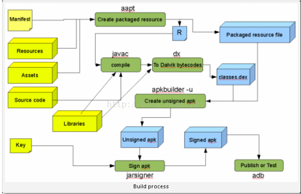

man keytool


## 实例
```
//生成证书
keytool -genkeypair\
            -keystore ./steady.keystore\
            -alias steady.keystore.alias\
            -keypass 123456\
            -storepass 123456\
            -validity 999999\
            -keyalg RSA \
            -keysize 2048

What is your first and last name?                     你的名字是什么
  [Unknown]:  猴砸
What is the name of your organizational unit?         组织单位
  [Unknown]:  水帘洞
What is the name of your organization?                 组织
  [Unknown]:  花果山
What is the name of your City or Locality?              国家
  [Unknown]:  傲来国
What is the name of your State or Province?            州或省
  [Unknown]:  东胜神州
What is the two-letter country code for this unit?      国家的双字母代码
  [Unknown]:  齐天大圣
Is CN=猴砸, OU=水帘洞, O=花果山, L=傲来国, ST=东胜神州, C=齐天大圣 correct?
  [no]:  yes


//使用证书签名正常通过签名
apksigner sign --ks release.jks app.apk
```

### 问题
如果生成证书阶段使用命令
```
keytool -genkeypair\
            -keystore ./steady.keystore\
            -alias steady.keystore.alias\
            -keypass 123456\
            -storepass 123456\
            -validity 999999\
```
在签名阶段会发生错误`java.security.InvalidKeyException`
```
Exception in thread "main" java.security.InvalidKeyException: Failed to sign using signer "STEADY_K"
	at com.android.apksig.internal.apk.v1.V1SchemeSigner.signManifest(V1SchemeSigner.java:295)
	at com.android.apksig.internal.apk.v1.V1SchemeSigner.sign(V1SchemeSigner.java:256)
	at com.android.apksig.DefaultApkSignerEngine.outputJarEntries(DefaultApkSignerEngine.java:372)
	at com.android.apksig.ApkSigner.sign(ApkSigner.java:395)
	at com.android.apksig.ApkSigner.sign(ApkSigner.java:178)
	at com.android.apksigner.ApkSignerTool.sign(ApkSignerTool.java:326)
	at com.android.apksigner.ApkSignerTool.main(ApkSignerTool.java:89)
Caused by: java.security.InvalidKeyException: Failed to sign using SHA1withDSA
	at com.android.apksig.internal.apk.v1.V1SchemeSigner.generateSignatureBlock(V1SchemeSigner.java:519)
	at com.android.apksig.internal.apk.v1.V1SchemeSigner.signManifest(V1SchemeSigner.java:293)
	... 6 more
Caused by: java.security.InvalidKeyException: The security strength of SHA-1 digest algorithm is not sufficient for this key size
	at sun.security.provider.DSA.checkKey(DSA.java:111)
	at sun.security.provider.DSA.engineInitSign(DSA.java:143)
	at java.security.Signature$Delegate.init(Signature.java:1156)
	at java.security.Signature$Delegate.chooseProvider(Signature.java:1116)
	at java.security.Signature$Delegate.engineInitSign(Signature.java:1180)
	at java.security.Signature.initSign(Signature.java:531)
	at com.android.apksig.internal.apk.v1.V1SchemeSigner.generateSignatureBlock(V1SchemeSigner.java:515)
	... 7 more

```

了解关键命令 -> `通过 man keytool 查看`
```
-keyalg     RSA
-keysize    2048
```
- `-keyalg`的默认值是 “DSA”
- 当`-keyalg`的值为`DSA`时，`-keysize`的默认值是`1024`
- 当`-keyalg`的值为`RSA`时，`-keysize`的默认值是`2048`


根据错误信息我们得出的论断是 `apksigner` 工具不接受签名算法为 `DSA:1024` 的证书对apk进行签名


## Reference
1. [对 APK 进行手动签名][https://developer.xamarin.com/zh-cn/guides/android/deployment,_testing,_and_metrics/publishing_an_application/part_2_-_signing_the_android_application_package/manually-signing-the-apk/]
2. [如何手动完成一次APK打包？----APK编译全过程](http://blog.csdn.net/wz249863091/article/details/52551629)
    - 