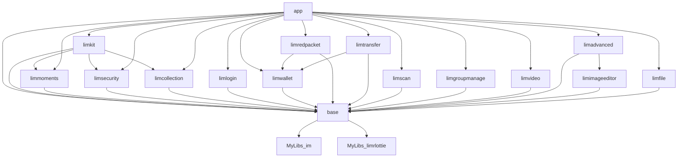

目标
1. 接手 Android 项目后 , 查看 依赖关系

情况说明
- 模块化 , 的 子模块们 都在一个项目下
- 如果模块化的子模块们在不同项目下 , 需要根据情况修改 正则


```

./gradlew -q :app:dependencies | grep -E '.*--- project.*|^$|^.+ Resolved configuration .+' \
> path/android_dependencies5.txt


/*
grep -E '.*--- project.*|^$' \
只过滤
1. 含有 `--- project` 的行 
2. 空行 `^$`
3. 含有 `Resolved configuration` 的行


------ 
想要  gradle 输出 APP 依赖  , 限定 variant ; 例如 devDebug ; 暂未实现 

*/
```

筛选结果需要关注某个 variant , 
```
ciDebugAnnotationProcessorClasspath - Resolved configuration for annotation-processor for variant: ciDebug
ciDebugCompileClasspath - Resolved configuration for compilation for variant: ciDebug
ciDebugRuntimeClasspath - Resolved configuration for runtime for variant: ciDebug
```
我们重点关注 `runtime for variant`


最终我们得到了 依赖关系 可视化 内容 (此 Markdown 内容在 VSCode 需要插件 Markdown Preview Mermaid Support 支持)
> 生成可视化图片也可以考虑另一个在线工具 : http://www.webgraphviz.com/ ; 本文没有使用在线工具




```

ciDebugRuntimeClasspath - Resolved configuration for runtime for variant: ciDebug
+--- project :base
|    +--- project :MyLibs:im
|    +--- project :MyLibs:limrlottie
+--- project :limkit
|    +--- project :base (*)
|    +--- project :limmoments
|    |    +--- project :base (*)
|    +--- project :limsecurity
|    |    +--- project :base (*)
|    \--- project :limcollection
|         +--- project :base (*)
+--- project :limlogin
|    +--- project :base (*)
+--- project :limwallet
|    +--- project :base (*)
+--- project :limredpacket
|    +--- project :base (*)
|    \--- project :limwallet (*)
+--- project :limtransfer
|    +--- project :base (*)
|    \--- project :limwallet (*)
+--- project :limscan
|    +--- project :base (*)
+--- project :limgroupmanage
|    +--- project :base (*)
+--- project :limmoments (*)
+--- project :limsecurity (*)
+--- project :limcollection (*)
+--- project :limvideo
|    +--- project :base (*)
+--- project :limadvanced
|    +--- project :base (*)
|    \--- project :limimageeditor
|         +--- project :base (*)
\--- project :limfile
     +--- project :base (*)

↓↓↓↓↓↓↓↓↓↓↓↓↓↓↓↓↓↓↓↓↓↓↓↓↓↓↓↓↓↓↓↓↓↓↓↓↓↓↓↓↓↓↓↓↓↓↓↓↓↓↓↓


ciDebugRuntimeClasspath - Resolved configuration for runtime for variant: ciDebug
app -> base
base -> MyLibs_im
base -> MyLibs_limrlottie
app -> limkit
limkit -> base
limkit -> limmoments
limmoments -> base
limkit -> limsecurity
limsecurity -> base
limkit -> limcollection
limcollection -> base
app -> limlogin
limlogin -> base
app -> limwallet
limwallet -> base
app -> limredpacket
limredpacket -> base
limredpacket -> limwallet
app -> limtransfer
limtransfer -> base
limtransfer -> limwallet
app -> limscan
limscan -> base
app -> limgroupmanage
limgroupmanage -> base
app -> limmoments
app -> limsecurity
app -> limcollection
app -> limvideo
limvideo -> base
app -> limadvanced
limadvanced -> base
limadvanced -> limimageeditor
limimageeditor -> base
app -> limfile
limfile -> base

```