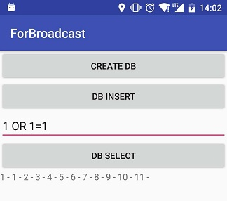
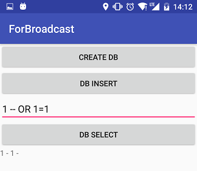
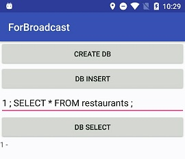

# Android 本地 SQL 注入？

## 一、写在开始
这仅仅是一个实验记录

## 二、回答标题的(最开始的)问题
Sqlite 可以完成注入。

## 三、涉及知识点
1. ContentProvider
2. SQLiteOpenHelper


## 四、试验代码
SQLiteOpenHelper
```java
public class MySQLiteOpenHelper extends SQLiteOpenHelper {
    private static final String DATABASE_NAME = "lunchlist.db";//数据库名称
    private static final int SCHEMA_VERSION = 1;//版本号,则是升级之后的,升级方法请看onUpgrade方法里面的判断
    private static final String TABLE_NAME = "restaurants";

    public MySQLiteOpenHelper(Context context) {//构造函数,接收上下文作为参数,直接调用的父类的构造函数
        super(context, DATABASE_NAME, null, SCHEMA_VERSION);
    }

    @Override
    public void onCreate(SQLiteDatabase db) {//创建的是一个午餐订餐的列表,id,菜名,地址等等
        db.execSQL("CREATE TABLE " + TABLE_NAME + " (_id INTEGER PRIMARY KEY AUTOINCREMENT, name TEXT, address TEXT, type TEXT, notes TEXT, phone TEXT);");
    }

    @Override
    public void onUpgrade(SQLiteDatabase db, int oldVersion, int newVersion) {
        if (oldVersion == 1 && newVersion == 2) {//升级判断,如果再升级就要再加两个判断,从1到3,从2到3
            db.execSQL("ALTER TABLE restaurants ADD phone TEXT;");
        }
    }

    public void insert(String name, String address, String type, String notes, String phone) {
        SQLiteDatabase sqLiteDatabase = this.getWritableDatabase();

        String insertSqlStr = String.format("INSERT INTO %s VALUES (null,%s,%s,%s,%s,%s);", TABLE_NAME, name, address, type, notes, phone);

        Log.i("insert", insertSqlStr);
        sqLiteDatabase.execSQL(insertSqlStr);


        sqLiteDatabase.close();
    }

    public List<String> query(String string) {
        SQLiteDatabase sqLiteDatabase = this.getReadableDatabase();
        String sqlSel = String.format("SELECT * FROM %s WHERE name = %s;", TABLE_NAME, string);
        Log.i("select", sqlSel);
        Cursor cursor = sqLiteDatabase.rawQuery(sqlSel, null);

        List<String> result = new ArrayList<>();
        if (cursor.moveToFirst()) {
            do {
                String address = cursor.getString(2);
                result.add(address);
            } while (cursor.moveToNext());
        }

        sqLiteDatabase.close();

        return result;
    }

}
```

Activity
```java
public class MainActivity extends AppCompatActivity implements View.OnClickListener {

    private TextView tvResult;
    private MySQLiteOpenHelper mySQLiteOpenHelper;
    private int index = 1;
    private EditText et_sqlInject;


    @Override
    protected void onCreate(Bundle savedInstanceState) {
        super.onCreate(savedInstanceState);
        setContentView(R.layout.activity_main);

        findViewById(R.id.btn_createDB).setOnClickListener(this);
        findViewById(R.id.btn_insert).setOnClickListener(this);
        findViewById(R.id.btn_select).setOnClickListener(this);
        this.tvResult = (TextView) findViewById(R.id.tv_result);
        this.et_sqlInject = (EditText) findViewById(R.id.et_sqlInject);

        this.initData();
    }

    private void initData() {
        this.mySQLiteOpenHelper = new MySQLiteOpenHelper(this);
    }

    @Override
    public void onClick(View v) {
        switch (v.getId()) {
            case R.id.btn_createDB:
                Toast.makeText(this, "没必要的动作", Toast.LENGTH_SHORT).show();
                break;
            case R.id.btn_insert:
                String str = "" + index;
                this.mySQLiteOpenHelper.insert(str, str, str, str, str);
                index++;
                break;
            case R.id.btn_select:
                String etStr = this.et_sqlInject.getText().toString();
                List<String> result = this.mySQLiteOpenHelper.query(etStr);
                String show = "";
                for (String value :
                        result) {
                    show += value + " - ";
                }
                this.tvResult.setText(show);
                break;
            default:
                Toast.makeText(this, "未定义的点击事件", Toast.LENGTH_SHORT).show();
                Log.i("haha", "未定义的点击事件");
        }
    }
}

```

## 五、检验步骤
1. 点击 DB Insert 按钮几次填入数据。
2. `String sqlSel = String.format("SELECT * FROM %s WHERE name = %s;", TABLE_NAME, string);` 根据查询代码斟酌注入语句。
3. 注入查询。
4. 注入效果：
    -    
    - 
    - 
    - 直接 注入 `“--”`  会崩溃。

## 六、但是
但是这又怎样呢，暂时几乎想象不到有什么至关重要的数据是放在手机上的。所以说这种注入操作的危害性只是理论上的。
- 不出错不放敏感数据的是否安全意识的开发者。
- 退一步说，哪怕可以不放敏感数据，但是只要可以放，只要放了可以被不授权查看，这就是风险了。
