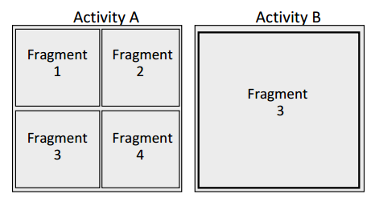

# (译)Android 于 Fragmments 陷落
1. 作者：Roee Hay
2. 就职：IBM Security Systems
3. 联系：roeeh@il.ibm.com
4. 译者：Tom
5. 联系：tom.work@foxmail.com

摘要—最近我们发现了 Android Framework 中的一个可以打破 Android 沙箱机制的漏洞。这个漏洞影响了很多 Android APP , 包括那些和 Android 系统相捆绑的应用(也就是系统应用)。这个漏洞已经在 Android KitKat (Android4.4 API19)中被打上补丁。

## 一、Android 基础
### 1.1、 威胁模型
Android 应用程序运行在一个沙盒(sandbox)环境中，一个应用运行在这个环境中，可以确保没有足够权限的三方应用无法访问/获取本应用的敏感数据。例如：作为三方应用是不能访问 Android 浏览器中存储的敏感信息(Cookies、cache、history)的。一个 Android App 在安装的时候可能会申请特定的权限，如果这些权限被用户授予，该应用的某些功能才能够正常运行。开发者向用户申请权限需要在 AndroidManifest.xml 文件中注册。

### 1.2、 Activity 和 Fragment 
Android 应用程序由包含在 activity 在内的各种组件组成。 我们说的 Activity 是 `android.content.Activity`[1] 或者它的子类，Activity 定义了一个独立的 UI 界面，例如一个内容浏览窗口或者一个个性化设置界面。从 Android 3.0 [2] 开始 Activity 中可以包含 Fragment。 我们所说的 Fragment 是 `android.app.Fragment`[3] 或者其子类， Fragment 提供了一个碎片化的 UI 。  Activity 允许在系统中的不同应用间复用，Fragment 提供了另一方面的 UI 重用能力，可以在同一个应用中复用。(下图 1)

- 
    - 图 1：Activitys 和 Fragments 之间的关系

### 1.3、 跨应用通信 Intent
Android 应用程序中大量使用跨应用通信(InterApp Communication)的技术。这是通过 Intent 实现的。通信过程中的数据以 object 的形式存在于 Intent 的属性(action, data, category,target and extras等，共7个)中。 data 属性是一个用于标示 Intent 的 URI (例如：tel:042212)。 每一个 Intent 都可以包含 extra 属性，该属性中保存了一个 bundle 对象(`android.os.Bundle`[4] 或者该类的子类)。 extra 属性可以通过 `android.content.Intent.putExtra` API 来设置，或者直接操作 bundle 对象。 要强调的重要的事情是：Intent 可以作为为恶意应用向存在漏洞应用注入恶意数据的通道。Intent 可以通过隐式(目标组件未指定)和显示(指定了目标组件)方式完成通信。Intent 可以通过 `startActivity`(用于启动一个 Activity 组件) 或者 `startService`(用于启动一个 Service 组件) 被广播出去。 在 manifest 文件中，应用程序的组件可以声明是否允许被外部 Intent 调用，并且可以设置启动该组件所需要的权限集。

## 二、 Preference Activities 和  Fragment 动态加载

Android Framework 提供了一个抽象(abstract) activity 类 `android.preference.PreferenceActivity` [5] ,该类代表一个层次化的偏好设置对象(UI)。如果一个 app 希望向用户展示偏好(preferences)可以继承 `PreferenceActivity` 并且派生自己需要的方法。 `PreferenceActivity` 会检查 Intent 中的几个 extal 数据字段，其中有趣的是：`PreferenceActivity.EXTRA_SHOW_FRAGMENT`(’:android:show_fragment’) 和 偏好数据 `Activity.EXTRA_SHOW_FRAGMENT_ARGUMENTS`(’:android:show_fragment_arguments’) 。 第一个 extra 字段包含了 Fragment 的 class 名字表示 PreferenceActivity 动态加载和展示的目标。 后一个 extra 包含传递给 Fragment 的 bundle 。被加载的 Fragment 也可以获取它的宿主 Activity (通过 Intent) 通过 `Fragment.getActivity` API。

- 
    - 图 2 Fragment 动态加载


下图展示了 `PreferenceActivity` 动态加载 `Fragmet` 的代码 `Fragment.instantiate` 。该方法使用反射(reflection)加载目标 Fragment 然后把结果赋予一个 Fragment 对象。(如图 3)

- 
    - 图 3 Fragment.instantiate (Android 4.3.1 r1)

## 三、 漏洞


任何实现 PreferenceActivity 的导出的 Activity 都可以通过动态加载 Fragment 的代码加载任意类。 一个恶意应用可以通过 Intent 方便的引用目标 Activity，该Intent 可以这两个属性携带数据 ’:android:show_fragment’(包含任意的 class 名字) 和 ’:android:show_fragment_arguments’(提供调用对象所需要的属性) ，当然通过别的属性可以携带数据。 PreferenceActivity 是通过 `dalvik.system.PathClassLoader` [6] 来完成类加载的，该 API 具有加载 `application package/android framework / java framework` 中任何 calss 的能力。被加载的 class 运行于漏洞应用的上下文中，并且和漏洞应用具有相同的权限，可以访问漏洞应用的私有数据。

## 四、 利用技巧
### 4.1、 构造函数的行为 

如上所述，攻击者可以加载任何( application package/Android framework/Java framework ) class 。任何非 Fragment及其派生类被加载都会造成 `java.lang.CastException (line 585 under Fragment.instantiate, see Figure 3)` 异常并崩溃。然而在异常被 throw 之前，会做两件事情。① class 中的 static 初始化行为被执行(如果在之前没有执行过)。② 空构造函数被执行。攻击者可以滥用这种行为并搜索在其构造函数中执行动作的类。引人注目的是 `Application package / java framework / Android framework` 中需要权限的 class 作用于漏洞应用，不作用于恶意应用。 除了可以选择并执行指定的 class 之外，更常用的是访问漏洞应用的敏感信息(通过正常途径无法访问的数据)。例如,一个漏洞应用或许只有很少的导出 activity 一些私有的 activity 仅仅在一些特殊的状态下被调用(例如：登录)。通常情况下，攻击者能够通过 Intent 调用导出的 activity ，但是调用那些状态依赖的 activity 是困难的(访问它们通常需要请求一些用户信息)，然而通过利用本漏洞攻击者可以实例化私有的不易访问的 activitys 并用来执行一些动作。

- 
    - 图 4 利用构造函数

### 4.2、 操作 Fragments

另一个机会是发现 Fragment class (范围上文说过 application package / Android frameworks / Java frameworks)。对比 4.1 提到的利用技巧，加载 fragment 不会造成异常/崩溃。这种情况下允许攻击者利用 Intent 提供的数据通道把恶意数据传递给目标 fragment(具体数据传输方式参照第二部分)。通常 fragment 期望被非导出的 activity 调用，因此它将信任并且认真使用传递过来的恶意数据。除了 static 初始化和默认的空构造函数被调用外，fragment 的生命周期也会正常执行。这意味着 `Fragment.onCreate` 类似的生命周期方法将被自动调用，因此更加有可能发生敏感操作。 甚至在自动调用的方法中如果没有敏感意图执行，也可以像使用自身组件一样的使用漏洞应用的组件(攻击者可以控制 UI 并导致被加载的 Fragment 执行一些操作)，使用本技术去攻击系统应用达到绕过限制的目的(请看图 5 中攻击 settings app 的示例)

- 
    - 图 5 通过 Fragment 利用

## 五、 真实的例子：Android Settings app

Settings 应用的主 activity ：com.android.settings.Settings(当然是 exported 的)，继承了 `PreferenceActivity` 。因此这是一个漏洞。这个应用包中包含了很多 fragment ，其中之一是 `ChooseLockPassword$ChooseLockPasswordFragment` 这个 fragment 所期望的是被 `ChooseLockPassword`(也继承 PreferenceSettings) 加载，后者是非导出的，依据在 manifest 文件中：
```xml
<activity
android:name="ChooseLockPassword"
android:exported="false" 
... />
```

尽管 `ChooseLockPassword$ChooseLockPasswordFragment` 正常情况下会被一个未导出的 activity 加载，但是因为这个漏洞的储存在，该 fragment 可以被恶意的应用所加载同时还会接收传入的数据。这个 Fragment 在 onCreate 方法中确实使用了其宿主 activity 中的数据。例如(图 6 )，fragment 从 extra 中读取了标示用户是否输入了正确的 PIN 码的数据 ’confirm_credentials’ 。

- 
    - 图 6 在`ChooseLockPassword$ChooseLockPasswordFragment`中获取指示用户输入值正误的凭据

正常情况相下 extra 值由宿主 activity(ChooseLockPassword) 通过 ChooseLockPasswordGeneric(该类中的 updateUnlockMethodAndFinish 方法) 提供，当且仅当用户已经确认了他的旧 PIN 该 extra 值被设置为 false。正常情况下，除非用户已经输入了正确的旧的 PIN 码，否则 ChooseLockPassword activity 不会被调用(只要携带 `confirm_credentials` 的参数的 Intent 被传递给 ChoseLockPassword 该 `confirm_credentials` 一定是 `true`) 。(UI 如图 7 )

- 
    - 图 7 修改 PIN 码：需要用户先输入正确的旧 PIN 码

使用者可以通过调用 Settings 中的 ChooseLockPassword$ChooseLockPasswordFragment 来绕过限制(通过上文提到的利用方式 _using the ’:android:show_fragment’ extra parameter, and invoking Settings with the ’confirm_credentials’ extra set to false, i.e. the second exploitation technique presented above_)。 这允许使用者在不验证旧 PIN 码的前提下修改 PIN 码。攻击流程如图 9 ，PoC 代码如图 10，结果展示如图 11。

- 
    - 图 9  Settings app 攻击流程
- 
    - 图 10  Settings app 利用代码
- 
    - 图 11 攻击时更改 PIN 码: 使用者不需要知道旧 PIN 码


## 六、 关于该漏洞的补丁

我们已经把这个安全事件反馈给 Android 安全团队，并且安全补丁已经在 Android 4.4 [7] 放出。该补丁在类中添加了一个新的方法`protected boolean isValidFragment (String fragmentName)` 。这个新的方法已经在 Android SDK 参考文件中给出了合理的解释：

>Added in API level 19     
>子类应该覆写本方法，用来验证给定的 fragment 是否被允许附加到对应的 Activity 上。 该方法的默认实现：在 androidSdkVerison=19 为 `return true` ，在之后的版本默认(没有覆写)抛出异常。    
>参数： fragmentName 代表调用者期望动态加载并附加到 activity 的 fragment。    
>返回值：在 fragment 被实例化之前，如果给定的 fragment 被宿主 activity 认定有有效 `return true`;其他其他情况下 `return false`。

`isValidFragment` 方法在 fragment 被实例化之前调用(如图 8)。覆写本方法，并且提供一个 fragment 白名单(允许在指定 activity 被实例化的 fragment 名单)是开发者的职责。

- 
    - Figure 8. Patched Fragment instantiation

## 七、 漏洞影响范围
Android 4.3 Jelly Bean [8] 及之前(androidSdkVerison <= 18).
## 八、 漏洞修复版本
Android 4.4 KitKat [7] (androidSdkVerison >= 19)
## 九、 披露时间线
- 12/05/2013 Android 安全团队回复:问题被修复
- 12/05/2013 请求状态更新.
- 11/11/2013 Android 安全团队回复:正在修复该问题
- 10/24/2013 请求状态更新.
- 07/14/2013 Android 安全团队回复:我们正在核实该问题
- 07/12/2013 向 Android 安全团队报告漏洞.
## 十、 Android play 中流行程序中存在该漏洞的程序
|Vulnerable         | App Activities                                                                         |
|-------------------|----------------------------------------------------------------------------------------|
|Google GMail       | GmailPreferenceActivity                                                                |
|Google Search      |SettingsActivity                                                                        |
|Google Pinyin Input| AdvancedSettingsActivity                                                               |
|DropBox            |PrefsActivity                                                                           |
|Evernote           |EvernotePreferenceActivity / AccountInfoPreferenceActivity / SecurityPreferenceActivity |

## 十一、参考
1. [1] Activity class reference. http://developer.android.com/reference/android/app/Activity.html.
2. [2] Android 3.0, Honeycomb. http://developer.android.com/about/versions/android-3.0-highlights.html.
3. [3] Fragment class reference. http://developer.android.com/reference/android/app/Fragment.html.
4. [4] Bundle class reference. http://developer.android.com/reference/android/os/Bundle.html.
5. [5] PreferenceActivity class reference. http://developer.android.com/reference/android/preference/PreferenceActivity.html.
6. [6] PathClassLoader class reference. http://developer.android.com/reference/dalvik/system/PathClassLoader.html.
7. [7] Android 4.4, KitKat. http://www.android.com/about/kitkat.
8. [8] Android 4.3, Jelly Bean. http://www.android.com/about/jelly-bean.

## Translate OVER


## 参考 & 引用
0. [白皮书拷贝](Resource\android-collapses-into-fragments.pdf)
1. 这是英文原版出处：http://securityintelligence.com/new-vulnerability-android-framework-fragment-injection/#comments
    - 该文章中也存在白皮书的下载
2. https://bbs.pediy.com/thread-183459.htm
3. https://yq.aliyun.com/articles/12826