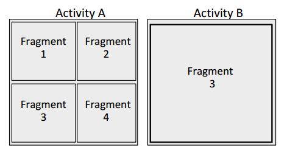

# (译)Android于Fragmments陷落
1. 作者：Roee Hay
2. 就职：IBM Security Systems
3. 联系：roeeh@il.ibm.com
4. 译者：Tom
5. 联系：tom.work@foxmail.com

摘要——最近我们发现了 Android Framework 中的一个可以打破 Android 沙箱机制的漏洞。这个漏洞影响了很多 Android APP , 包括哪些和 Android 系统相捆绑的应用(也就是系统应用)。这个漏洞已经在 Android KitKat (Android4.4 API19)中被打上补丁。

## 一、Android 基础
### 1.1、 威胁模型
Android 应用程序运行在一个沙盒(sandbox)环境中，这个环境可以确保没有足够权限的三方应用无法访问/获取本应用的敏感数据。例如：作为三方应用是不能访问 Android 浏览器中存储的敏感信息(Cookies、cache、history)的。一个 Android App 在安装的时候可能会申请特定的权限，如果这些权限被用户授予该应用的某些功能才能够正常运行。开发者向用户申请权限需要在 AndroidManifest.xml 文件中注册。

### 1.2、 Activity 和 Fragment 们
Android 应用程序被包含于 Activity 中的各种组件所组成。 我们说的 Activity 是 `android.content.Activity`[1] 或者它的子类，Activity 定义了一个独立的 UI 界面，例如一个内容浏览窗口或者一个个性化设置界面。从 Android 3.0 [2] 开始 Activity 中可以包含 Fragment。 我们所说的 Fragment 是 `android.app.Fragment`[3] 或者其子类，Fragment 提供了一个碎片化的 UI 。  Activity 允许在系统中的不同应用间复用，Fragment 提供了比这更优越的 UI 重用能力，可以在同一个应用中复用。(下图 1)

- 
    - 图 1：Activitys 和 Fragments 之间的关系

### 1.3、 跨应用通信 Intent
Android applications make heavy大量 use of InterApp Communication. This is achieved实现 by Intents.These are messaging objects which contain several attributes such as an action, data, category,target and extras. The data attribute is a URI which identifies the intent (e.g. tel:0422123). Each Intent can also contain extra data fields (Intent ’extras’) which reside具备 inside a bundle (implemented by the android.os.Bundle class [4]).These extra fields can be set by using the android.content.Intent.putExtra API or by manipulating操控 the extras bundle directly直接地. It is important to emphasize强调 that intents provide a channel通道 for a malicious恶意的 app to inject malicious恶意的 data into a target, potentially潜在地 vulnerable漏洞 app. Intents can be sent anonymously匿名地 (implicit隐式 intents, i.e. target is not specified) and non-anonymously (explicit显示 intents, target is specified). Intents can be broadcast, passed通过 to the startActivity call (when an application starts another activity), or passed to the startService call(when an application starts a service). Under the application’s manifest file, an application component组件 may claim声明 whether it can be invoked调用 externally外部地 using an Intent, and if so which set of permissions is required.

Android 应用程序中大量使用跨应用通信(InterApp Communication)的技术。这是通过 Intent 实现的。通信过程中的数据以 object 的形式存在于 Intent 的属性(action, data, category,target and extras等，共7个)中。 data 属性是一个用于标示 Intent 的 URI (例如：tel:042212)。 每一个 Intent 都可以包含 extra 属性，概述心中保存了一个 bundle 对象(`android.os.Bundle`[4] 或者该类的子类)。 extra 属性可以通过 `android.content.Intent.putExtra` API 来设置，或者直接操作 bundle 对象。 要强调的重要的事情是：Intent 为恶意应用向存在漏洞的 APP 注入恶意数据的通道。Intent 可以通过隐式(目标组件未指定)和显示(指定了目标组件)方式完成通信。Intent 可以通过 `startActivity`(用于启动一个 Activity 组件) 或者 `startService`(用于启动一个 Service 组件) 被广播出去。 在 manifest 文件中，应用程序的组件可以声明是否允许被外部 Intent 调用，并且可以设置启动该组件所需要的权限集。

## 二、 Preference Activities 和  Fragment 动态加载
The Android Framework provides an abstract activity class, android.preference.PreferenceActivity [5] which presents a hierarchy层次 of preferences偏好. An App which wants to show preferences to the user can extend this activity to derive派生 its functionality. The base activity class examines检查 several几个 extra data fields字段 in the input Intent, among在…之中 them two are interesting:PreferenceActivity.EXTRA_SHOW_FRAGMENT(’:android:show_fragment’) and Preference-2 Activity.EXTRA_SHOW_FRAGMENT_ARGUMENTS(’:android:show_fragment_arguments’). The first extra field contains a Fragment class name and causes a PreferenceActivity activity to dynamically display it upon creation. The latter contains the Fragment input bundle. A loaded Fragment can also receive input arguments by accessing its host activity (and therefore its input Intent) using the Fragment.getActivity API.

Android Framework 提供了一个抽象(abstract) activity 类 `android.preference.PreferenceActivity` [5] ,该类代表一个层次化的偏好设置对象(UI)。如果一个 app 希望向用户展示偏好(preferences)可以继承 `PreferenceActivity` 并且派生自己需要的方法。 `PreferenceActivity` 会检查 Intent 中的几个 extal 数据字段，其中有趣的是：`PreferenceActivity.EXTRA_SHOW_FRAGMENT`(’:android:show_fragment’) 和 Preference-2 `Activity.EXTRA_SHOW_FRAGMENT_ARGUMENTS`(’:android:show_fragment_arguments’) 。 第一个 extra 字段包含了 Fragment 的 class 名字表示 PreferenceActivity 动态加载和展示的目标。 后一个 extra 包含传递给 Fragment 的 bundle 。被加载的 Fragment 也可以获取它的宿主 Activity (因此需要使用 Intent) 通过 `Fragment.getActivity` API。

- 
    - 图 2 Fragment 动态加载

Code under PreferenceActivity calls a dynamic Fragment loading function, Fragment.instantiate.This function loads the Fragment using reflection,and then casts it into a Fragment object (see Figure 3)

下图展示了 `PreferenceActivity` 动态加载 `Fragmet` 的代码 `Fragment.instantiate` 。该方法使用反射(reflection)加载目标 Fragment 然后把结果赋予一个 Fragment 对象。(如图 3)

- 
    - 图 3 Fragment.instantiate (Android 4.3.1 r1)

## 三、 漏洞
Any app which implements and exports an activity that extends a PreferenceActivity class can be subverted颠覆 to load an arbitrary任意的 class by exploiting利用 the dynamic fragment loading process. A malicious app can simply invoke引用 the target activity using an Intent object with an ’:android:show_fragment’ extra field containing the arbitrary class name, and provide it arguments using the ’:android:show_fragment_arguments’ extra or by other intent fields. In the context of PreferenceActivity, the class loader which is used is dalvik.system.PathClassLoader [6] which enables it to load classes belonging the the vulnerable app,Android or Java frameworks. The loaded class will run in the context of the vulnerable app, will have the same privileges of it and have access to its private data.

任何实现 PreferenceActivity 的 Activity 都可以通过动态加载 Fragment 的代码被攻陷，完成加载任意 class 的动作。 一个恶意应用可以通过携带 ’:android:show_fragment’(包含任意的 class 名字) 和 ’:android:show_fragment_arguments’(提供调用对象所需要的属性) 的 Intent 方便的引用目标 Activity。 PreferenceActivity 的 context 是通过 `dalvik.system.PathClassLoader` [6] 来完成类加载的，该 API 具有加载 应用自身/android系统/java框架 中任何 calss 的能力。被加载的 class 运行于漏洞应用的上下文中，并且和漏洞应用具有相同的权限，可以访问漏洞应用的私有数据。

## 四、 利用技巧
### 4.1、 构造函数的行为 
As explained说明解释 above, the attacker can load any class under the application’s package or under the Android/Java framework. Any class which does not extends Fragment will cause a java.lang.CastException exception (line 585 under Fragment.instantiate, see Figure 3) and crash. However, before the casting exception is thrown, two events take place. First, the static initializer of the class is run (if it hasn’t run before). Second, its empty constructor is executed. The attacker can abuse滥用 this behavior and search for a class which does actions in its constructors. Attractive引人注意的 Java/Android classes would be ones that require privileges that are available to the vulnerable app but not to the malicious app. Application classes provide the same benefit好处/利益 of Java/Android classes (except for the fact事实 that they should be chosen选择 specifically for each vulnerable app), but (in addition to除…之外) that, they are more likely to access sensitive information which is private to the vulnerable app and not otherwise accessible to the attacker. For example, a vulnerable app may have a few exported activities, and some private ones which are only invoked调用 in a particular state (e.g. after login). Normally, the attacker is able to invoke the exported activity classes by intents, but cannot easily invoke the state-dependent状态依赖 classes (accessing them usually requires a user interaction), however by exploiting利用 the vulnerability he is able to instantiate the private activities which possibly perform some actions.

如上所述，攻击者可以加载任何( application package/Android framework/Java framework ) class 。任何非 Fragment及其派生类被加载都会造成 `java.lang.CastException (line 585 under Fragment.instantiate, see Figure 3)` 异常并崩溃。然而在异常被 throw 之前，会做两件事情。① class 中的 static 初始化行为被执行(如果在之前没有执行过)。② 空构造函数被执行。攻击者可以滥用这种行为并搜索在其构造函数中执行动作的类。引人注目的是 Application/java/Android 中需要权限的 class 作用于漏洞应用，不作用于恶意应用。 除了可以选择并执行指定的 class 之外，更常用的是访问漏洞应用的敏感信息(通过正常途径无法访问的数据)。例如,一个漏洞应用或许只有很少的导出 activity 一些私有的 activity 仅仅在一些特殊的状态下被调用(例如：登录)。通常情况下，攻击者能够通过 Intent 调用导出的 activity ，但是调用那些状态依赖的 activity 是困难的(访问它们通常需要请求一些用户信息)，然而通过利用本漏洞攻击者可以实例化私有的不易访问的 activitys 并用来执行一些动作。

- 
    - 图 4 利用构造函数

### 4.2、 操作 Fragments
Another opportunity is to find a Fragment class (again under the application package or Android/Java frameworks). In contrast对比 to the previous technique, loading a fragment would not cause a CastException exception. It allows the attacker to feed the fragment with malicious data by using the input channels described in Section II. Usually the fragment is expected期望 to be loaded by a non-exported (private) activity class thus因此 it will trust信任 the input data and consider them genuine. In addition to the static initializer and default constructor, the fragment lifecycle takes place. This means that methods such as Fragment.onCreate will be automatically invoked thus it is more likely that sensitive actions will occur发生. Even if no sensitive action is performed执行 in automatically invoked methods, the attacker can be the device装置 owner himself or a thief小偷 (thus he can control the UI and cause the loaded fragment to perform some action), and use this technique in order to attack system applications and bypass绕过 restrictions限制 (see Section V for an example of attacking the Settings app).

另一个机会是发现 Fragment class (范围上文说过 appkication package / Android frameworks /Java frameworks)。对比 4.1 提到的利用技巧，加载 fragment 不会造成异常/崩溃。这种情况下允许攻击者利用 Intent 提供的数据通道把恶意数据传递给目标 fragment(具体数据传输方式参照第二部分)。通常 fragment 期望被非导出的 activity 调用，因此它将信任并且认真使用传递过来的恶意数据。除了 static 初始化和默认的空构造函数被调用外，fragment 的生命周期也会正常执行。这意味着 `Fragment.onCreate` 类似的生命周期方法将被自动调用，因此更加有可能发生敏感操作。 甚至在自动调用的方法中如果没有敏感意图执行，也可以想使用自身组件一样的使用漏洞应用的组件(攻击者可以控制 UI 并导致被加载的 Fragment 执行一些操作)，使用本技术去攻击系统应用达到绕过限制的目的(请看图 5 中攻击 settings app 的示例)

- 
    - 图 5 通过 Fragment 利用

## 五、 真实的例子：Android Settings app
The Settings app’s main activity (which is [of course]当然 public), com.android.settings.Settings, extends PreferenceActivity. Therefore it is vulnerable. The package contains many fragments, one of them is ChooseLockPassword$ChooseLockPasswordFragment. This fragment is expected预期 to be loaded under the ChooseLockPassword class (also extends PreferenceSettings) which is not exported according依据 to the manifest file:

Settings 应用的主 activity ：com.android.settings.Settings(当然是 exported 的)，继承了 `PreferenceActivity` 。因此这是一个漏洞。这个应用包中包含了很多 fragment ，其中之一是 `ChooseLockPassword$ChooseLockPasswordFragment` 这个 fragment 所期望的是被 `ChooseLockPassword`(也继承 PreferenceSettings) 加载，后者是非导出的，依据在 manifest 文件中：
_上述关于 PreferenceSettings 我没有理解到位。_
```xml
<activity
android:name="ChooseLockPassword"
android:exported="false" 
... />
```

The vulnerability allows an external外部 malicious app to load this fragment and provide it data despite尽管 its normal instantiation实例 under a non-exported activity. This fragment does indeed确实 consume消耗 data from its host activity under its onCreate method. For example, it reads the extra value ’confirm_credentials’ which indicates指定 whether the user has entered the correct PIN code. The default value for this attribute is true (see Figure 6).

尽管 `ChooseLockPassword$ChooseLockPasswordFragment` 正常情况下会被一个未导出的 activity 加载，但是因为这个漏洞的储存在，该 fragment 可以被恶意的应用所加载同时还会接收传入的数据。这个 Fragment 在 onCreate 方法中确实使用了其宿主 activity 中的数据。例如(图 6 )，fragment 从 extra 中读取了标示用户是否输入了正确的 PIN 码的数据 ’confirm_credentials’ 。

- 
    - 图 6 在`ChooseLockPassword$ChooseLockPasswordFragment`中获取指示用户输入值正误的凭据

Figure 6. confirmCredentials initialization under ChooseLockPassword$ChooseLockPasswordFragment


Normally this extra value is provided to the host activity (ChooseLockPassword) by ChooseLockPasswordGeneric (under the function updateUnlockMethodAndFinish) and should be set to false if and only if the user has confirmed his password. The conclusion结论 is that the ChooseLockPassword activity cannot be invoked调用 with a confirm_extra set to false unless the user has actually confirmed证实 the credentials凭据 (as shown in Figure 7).

正常情况相下 extra 值由宿主 activity(ChooseLockPassword) 通过 ChooseLockPasswordGeneric(该类中的 updateUnlockMethodAndFinish 方法) 提供，该 extra 值才会被设置为 false,除非当用户已经输入了正确的旧 PIN。正常情况下，除非用户已经输入了正确的旧的 PIN 码，否则 ChooseLockPassword activity 不会被调用(只要携带 `confirm_credentials` 的参数的 Intent 被传递给 ChoseLockPassword 该 `confirm_credentials` 一定是 `true`) 。(UI 如图 7 )

- 
    - 图 7 修改 PIN 码：需要用户先输入正确的旧 PIN 码

Figure 7. PIN code changing: user must supply old password


A user can bypass绕过 this restriction限制 by hosting ChooseLockPassword$ChooseLockPasswordFragment inside Settings (using the ’:android:show_fragment’ extra parameter, and invoking Settings with the ’confirm_credentials’ extra set to false, i.e. the second exploitation利用 technique [presented above]上文提到). This allows允许 to user to change the device PIN code without proving验证 that he knows the old one.The attack flow is shown in Figure 9, PoC code provided in figure 10, Result is displayed in Figure 11).

使用者可以通过调用 Settings 中的 ChooseLockPassword$ChooseLockPasswordFragment 来绕过限制(通过上文提到的利用方式 _using the ’:android:show_fragment’ extra parameter, and invoking Settings with the ’confirm_credentials’ extra set to false, i.e. the second exploitation technique presented above_)。 这允许使用者在不验证旧 PIN 码的前提下修改 PIN 码。攻击流程如图 9 ，PoC 代码如图 10，结果展示如图 11。

- 
    - 图 9  Settings app 攻击流程
- 
    - 图 10  Settings app 利用代码
- 
    - 图 11 攻击时更改 PIN 码: 使用者不需要知道旧 PIN 码


## 六、 关于该漏洞的补丁
We reported the security issue to the Android Security Team and a patched PreferenceActivity class is provided in Android 4.4 [7]. The patched class contains a new method `protected boolean isValidFragment (String fragmentName)`. The new method has been given an appropriate适当的 documentation in the Android SDK reference参考 [5]:

我们已经把这个安全事件反馈给 Android 安全团队，并且安全补丁已经在 Android 4.4 [7] 放出。该补丁在类中添加了一个新的方法`protected boolean isValidFragment (String fragmentName)` 。这个新的方法已经在 Android SDK 参考文件中给出了合理的解释：

>Added in API level 19 
>Subclasses should override this method and verify验证 that the given fragment is a valid type to be attached to this activity. The default implementation returns true for apps built for android:targetSdkVersion older than KITKAT. For later versions, it will throw an exception. 
>Parameters fragmentName the class name of the Fragment about to be attached to this activity. Returns true if the fragment class name is valid for this Activity and false otherwise which is called before the fragment is instantiated."

>Added in API level 19 
>子类应该覆写本方法，用来验证给定的 fragment 是否被允许附加到对应的 Activity 上。 该方法的默认实现在 androidSdkVerison=19 为 `return true` 在之后的版本默认(没有覆写)抛出异常。
>参数： fragmentName 代表调用者期望动态加载并附加到 activity 的 fragment。
>返回值：在 fragment 被实例化之前，如果给定的 fragment 被本 activity 认定有有效 `return true`;其他其他情况下 `return false`。

The `isValidFragment` method is called before the fragment is instantiated (see Figure 8). It is the responsibility of the developer to override it to provide a white-list of fragments that are allowed to be loaded within a specific activity.

`isValidFragment` 方法在 fragment 被实例化之前调用(如图 8)。覆写本方法，并且提供一个 fragment 白名单(允许在指定 activity 被实例化的 fragment 名单)是开发者的职责。

- 
    - Figure 8. Patched Fragment instantiation


## 七、 漏洞影响范围
Android 4.3 Jelly Bean [8] 及之前(androidSdkVerison <= 18).
## 八、 漏洞修复版本
Android 4.4 KitKat [7] (androidSdkVerison >= 19)
## 九、 披露时间线
- 12/05/2013 Android 安全团队回复:问题被修复
- 12/05/2013 请求状态更新.
- 11/11/2013 Android 安全团队回复:正在修复该问题
- 10/24/2013 请求状态更新.
- 07/14/2013 Android 安全团队回复:我们正在核实该问题
- 07/12/2013 向 Android 安全团队报告漏洞.
## 十、 Android play 中流行程序中存在该漏洞的程序
|Vulnerable         | App Activities                                                                         |
|-------------------|----------------------------------------------------------------------------------------|
|Google GMail       | GmailPreferenceActivity                                                                |
|Google Search      |SettingsActivity                                                                        |
|Google Pinyin Input| AdvancedSettingsActivity                                                               |
|DropBox            |PrefsActivity                                                                           |
|Evernote           |EvernotePreferenceActivity / AccountInfoPreferenceActivity / SecurityPreferenceActivity |

## 十一、参考
1. [1] Activity class reference. http://developer.android.com/reference/android/app/Activity.html.
2. [2] Android 3.0, Honeycomb. http://developer.android.com/about/versions/android-3.0-highlights.html.
3. [3] Fragment class reference. http://developer.android.com/reference/android/app/Fragment.html.
4. [4] Bundle class reference. http://developer.android.com/reference/android/os/Bundle.html.
5. [5] PreferenceActivity class reference. http://developer.android.com/reference/android/preference/PreferenceActivity.html.
6. [6] PathClassLoader class reference. http://developer.android.com/reference/dalvik/system/PathClassLoader.html.
7. [7] Android 4.4, KitKat. http://www.android.com/about/kitkat.
8. [8] Android 4.3, Jelly Bean. http://www.android.com/about/jelly-bean.

## Translate OVER

## 参考 & 引用
1. 这是英文原版出处：http://securityintelligence.com/new-vulnerability-android-framework-fragment-injection/#comments
2. https://bbs.pediy.com/thread-183459.htm
3. https://yq.aliyun.com/articles/12826


