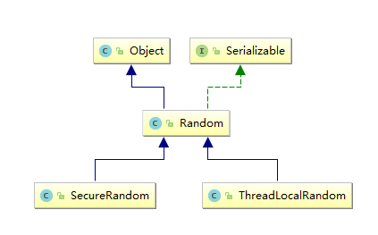

# SecureRandom / Random

## 一、UML
- 

1. Random
2. SecureRandom
3. Math.random()

## 二、 Random
Random类中实现的随机算法是伪随机，也就是有规则的随机。在进行随机时，随机算法的起源数字称为种子数(seed)，在种子数的基础上进行 __一定的变换__ ，从而产生需要的随机数字。

相同种子数的Random对象，相同次数生成的随机数字是完全相同的。也就是说，两个种子数相同的Random对象，第一次生成的随机数字完全相同，第二次生成的随机数字完全相同，第三次生成的随机数字完全相同，……四……，……五……。这点在生成多个随机数字时需要特别注意。

### 2.1、 检验认知
测试代码
```java
    public static void testDel() {
        Random random = new Random(9999999);
        for (int i = 0; i < 10; i++) {
            System.out.println("First\t" + random.nextInt());
        }
        System.out.println("--------------------------------------");

        Random random1 = new Random(9999999);
        for (int i = 0; i < 10; i++) {
            System.out.println("Second\t" + random1.nextInt());
        }
    }
```
控制台输出
```terminal
E:\jdk\jdk1.8.0_144\bin\java "-javaagent……………………
First	-2059583269
First	-1341125360
First	-1491505885
First	466292782
First	2133238267
First	1570412774
First	1743243888
First	1512416210
First	1795524489
First	955105417
--------------------------------------
Second	-2059583269
Second	-1341125360
Second	-1491505885
Second	466292782
Second	2133238267
Second	1570412774
Second	1743243888
Second	1512416210
Second	1795524489
Second	955105417

Process finished with exit code 0
```

## 三、 过渡
### 3.1、 Random
Random 可以完成 __伪__ 随机数的生成，这可以满足一定的业务场景。但是因为其随机性的可预测性在一些需要真正随机数的场合就不能满足需求了。

在 JDK7 API 中有提示
>Instances of java.util.Random are not cryptographically secure. Consider instead using SecureRandom to get a cryptographically secure pseudo-random number generator for use by security-sensitive applications.
>>java.util.Random 不具有密码安全性。请考虑使用 SecureRandom 来获取密码安全的伪随机数，供敏感的应用程序使用。

上述提示在 JDK6 API 中是没有的。如果你编译过 Android 源代码你会知道 [Android2.+ , 笔者暂不确定] 这个范围内 Android 依赖的是 JDK6 
### 3.2、 SecureRandom
关于 SecureRandom 的使用风险，[Android 官方博客有提及(可能需要Jump GFW)](https://android-developers.googleblog.com/2013/02/using-cryptography-to-store-credentials.html) 这个风险有一个节点，针对 Android 系统版本：[-∞ , 4.2) 会出现 SecureRandom 制造的随机数可预测。

所以这件事情我们可以猜个大概
1. JDK 在 1.6 和 1.7 之间或者其中的某一个子版本解决了 SecureRandom 产生的随机数可预测的问题，Android 直接拿来用了。
2. Android 在 JDK 的基础上对其代码进行了修改，解决了 SecureRandom 产生的随机数可预测的问题。
3. 综合上述两点，我们继续考虑 Android4.2 到底是依赖的哪一个 JDK 版本，这件事情有意义，但是意义不大。

关于上述 Android 团队的博客，我们还需要了解的知识点还包括(这几点我们只有结果):
1. OpenSSL & SecureRandom 二者是如何有机结合的。
2. 其所推荐的做法的内部实现细节和逻辑又是什么(下述做法针对 Android 4.2 之前的版本给出)：
    ```java
    //获取安全(不可预测)随机数的方案一：
    public static SecretKey generateKey() throws NoSuchAlgorithmException {
        // Generate a 256-bit key
        final int outputKeyLength = 256;

        SecureRandom secureRandom = new SecureRandom();
        // Do *not* seed secureRandom! Automatically seeded from system entropy.
        KeyGenerator keyGenerator = KeyGenerator.getInstance("AES");
        keyGenerator.init(outputKeyLength, secureRandom);
        SecretKey key = keyGenerator.generateKey();
        return key;
    }

    //获取 “更” 安全(不可预测)随机数的方式二：
    public static SecretKey generateKey(char[] passphraseOrPin, byte[] salt) throws NoSuchAlgorithmException, InvalidKeySpecException {
        // Number of PBKDF2 hardening rounds to use. Larger values increase
        // computation time. You should select a value that causes computation
        // to take >100ms.
        final int iterations = 1000; 

        // Generate a 256-bit key
        final int outputKeyLength = 256;

        SecretKeyFactory secretKeyFactory = SecretKeyFactory.getInstance("PBKDF2WithHmacSHA1");
        KeySpec keySpec = new PBEKeySpec(passphraseOrPin, salt, iterations, outputKeyLength);
        SecretKey secretKey = secretKeyFactory.generateSecret(keySpec);
        return secretKey;
    }
    ```


## 四、 SecureRandom
SecureRandom 风险范围 [1,16]
### 4.1
风险状况解释：在 Android 4.2 之前版本中
```java
SecureRandom.SecureRandom(byte[] seed)
SecureRandom.setSeed(long seed)
SecureRandom.setSeed(byte[] seed)
```
上述方法会替换系统 seed 从而导致结果可预测。

关于本 API 的风险验证
- Android 4.1 API 16

测试代码
```java
String strSeed = "www.testin.cn";
SecureRandom secureRandom = new SecureRandom();
secureRandom.setSeed(strSeed.getBytes());
// Prior to Android 4.2, the next line would always return the same number!
for (int i = 0; i < 10; i++) {
    Log.e(TAG, "" + secureRandom.nextInt());
}
```
日志输出(上述代码运行两次)：
```terminal
/com.example.tom.forbroadcast E/MainActivity: 1442704934
/com.example.tom.forbroadcast E/MainActivity: -448976346
/com.example.tom.forbroadcast E/MainActivity: -441314471
/com.example.tom.forbroadcast E/MainActivity: -698222874
/com.example.tom.forbroadcast E/MainActivity: -526720071
/com.example.tom.forbroadcast E/MainActivity: 670920711
/com.example.tom.forbroadcast E/MainActivity: -1429083402
/com.example.tom.forbroadcast E/MainActivity: -1024198372
/com.example.tom.forbroadcast E/MainActivity: 712315568
/com.example.tom.forbroadcast E/MainActivity: 1106697572
----------------------------------------------------------------------------
/com.example.tom.forbroadcast E/MainActivity: 1442704934
/com.example.tom.forbroadcast E/MainActivity: -448976346
/com.example.tom.forbroadcast E/MainActivity: -441314471
/com.example.tom.forbroadcast E/MainActivity: -698222874
/com.example.tom.forbroadcast E/MainActivity: -526720071
/com.example.tom.forbroadcast E/MainActivity: 670920711
/com.example.tom.forbroadcast E/MainActivity: -1429083402
/com.example.tom.forbroadcast E/MainActivity: -1024198372
/com.example.tom.forbroadcast E/MainActivity: 712315568
/com.example.tom.forbroadcast E/MainActivity: 1106697572
```
### 4.2
在 Android 4.2 之后 
```java
SecureRandom.SecureRandom(byte[] seed)
SecureRandom.setSeed(long seed)
SecureRandom.setSeed(byte[] seed)
```
上述方法会以追加的方式向系统 seed 之后添加数据，所以不会出现结果可预测的状况。


## 五、修复建议
>修复建议针对 4.1 中的情况给出。

如果想使用随机数并且希望随机数的结果不可预测。
1. 不要使用 `SecureRandom.SecureRandom(byte[] seed)` 构造函数
2. 在 初始化 `SecureRandom` 实例后调用 `nextXXXX` 方法前不要调用 `setSeed`


## 参考 & 摘录
1. [JAVA的Random类(转)](https://www.cnblogs.com/Fskjb/archive/2009/08/29/1556417.html)
2. [Random API Eng](https://docs.oracle.com/javase/7/docs/api/java/util/Random.html)
3. [Random API Zh](http://tool.oschina.net/uploads/apidocs/jdk-zh/java/util/Random.html)
4. [SecureRandom API Eng](https://docs.oracle.com/javase/7/docs/api/java/security/SecureRandom.html)
5. [SecureRandom API Zh](http://tool.oschina.net/uploads/apidocs/jdk-zh/java/security/SecureRandom.html)
6. [SecureRandom漏洞解析](http://jaq.alibaba.com/blog.htm?id=47)
7. [Using Cryptography to Store Credentials Safely](https://android-developers.googleblog.com/2013/02/using-cryptography-to-store-credentials.html)


