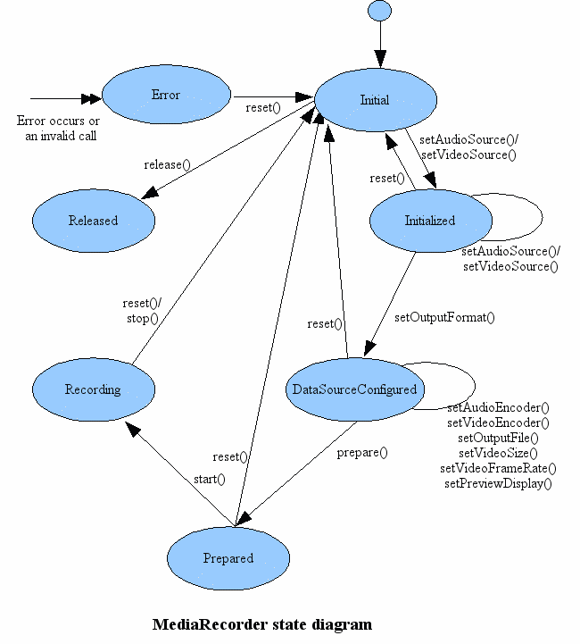

## 一、涉及权限(加粗)
|序号 |    权限组       |权限                     |完整字段                                         |
|:---:|----------------|-------------------------|---------------------------------               |
|1    |CALENDAR        |READ_CALENDAR            |android.permission.READ_CALENDAR                |
| 2   |                |WRITE_CALENDAR           |android.permission.WRITE_CALENDAR               |
|  3  |CAMERA          |CAMERA                   |android.permission.CAMERA                       |
|   4 |CONTACTS        |READ_CONTACTS            |android.permission.READ_CONTACTS                |
|    5|                |WRITE_CONTACTS           |android.permission.WRITE_CONTACTS               |
|6    |                |GET_ACCOUNTS             |android.permission.GET_ACCOUNTS                 |
| 7   |LOCATION        |ACCESS_FINE_LOCATION     |android.permission.ACCESS_FINE_LOCATION         |
|  8  |                |ACCESS_COARSE_LOCATION   |android.permission.ACCESS_COARSE_LOCATION       |
|   9 |__MICROPHONE__  |RECORD_AUDIO             |android.permission.RECORD_AUDIO                 |
|   10|PHONE           |READ_PHONE_STATE         |android.permission.READ_PHONE_STATE             |
|11   |                |CALL_PHONE               |android.permission.CALL_PHONE                   |
|  12 |                |READ_CALL_LOG            |android.permission.READ_CALL_LOG                |
|   13|                |WRITE_CALL_LOG           |android.permission.WRITE_CALL_LOG               |
|14   |                |ADD_VOICEMAIL            |com.android.voicemail.permission.ADD_VOICEMAIL  |
|  15 |                |USE_SIP                  |android.permission.USE_SIP                      |
|   16|                |PROCESS_OUTGOING_CALLS   |android.permission.PROCESS_OUTGOING_CALLS       |
|17   |SENSORS         |BODY_SENSORS             |android.permission.BODY_SENSORS                 |
|  18 |SMS             |SEND_SMS                 |android.permission.SEND_SMS                     |
|   19|                |RECEIVE_SMS              |android.permission.RECEIVE_SMS                  |
|20   |                |READ_SMS                 |android.permission.READ_SMS                     |
|  21 |                |RECEIVE_WAP_PUSH         |android.permission.RECEIVE_WAP_PUSH             |
|   22|                |RECEIVE_MMS              |android.permission.RECEIVE_MMS                  |
|23   |STORAGE         |READ_EXTERNAL_STORAGE    |android.permission.READ_EXTERNAL_STORAGE        |
|  24 |                |WRITE_EXTERNAL_STORAGE   |android.permission.WRITE_EXTERNAL_STORAGE       |

## 二、 涉及 API 
1. android.media.MediaRecorder
2. android.media.AudioRecord 
3. 一方面是上述方法，另一方面是上述方法中的某些属性，使用这些方法和属性会需要权限。

### 2.1、 android.media.MediaRecorder
> 

要使用本 API 完成系列操作就必须按照状态机的流程走。此处是要录音。
故 `setAudioSource` 方法是必经之路，恰好这个方法需要此次关注的权限。由此确定如果使用本权限，就需要调用这个方法，当然这只是一种情况，看下文。

再确认一下录制音频是否需要 audio 权限：
- 要在录制视频的同时录制音频需要做的事情就是在录制视频的代码中加入录制音频的代码，编写录制音频的代码需要权限。因此上述结论维持不变。

### 2.2、 android.media.AudioRecord 
录制音频的两个方法：
1. startRecording(MediaSyncEvent syncEvent)
2. startRecording()
 

## 参考 & 抄录
1. [【Android】【录音】Android录音--AudioRecord、MediaRecorder](http://www.cnblogs.com/Amandaliu/archive/2013/02/04/2891604.html)
2. [android进行录音功能并保存播放](http://blog.csdn.net/myname_kk/article/details/49910043)
3. [录制视频](https://www.cnblogs.com/whoislcj/p/5583833.html)
4. [Android音频开发（1）：基础知识 ](http://ticktick.blog.51cto.com/823160/1748506)
5. [Android音频开发之使用AudioRecord录制](http://blog.csdn.net/i_do_can/article/details/53869875)
