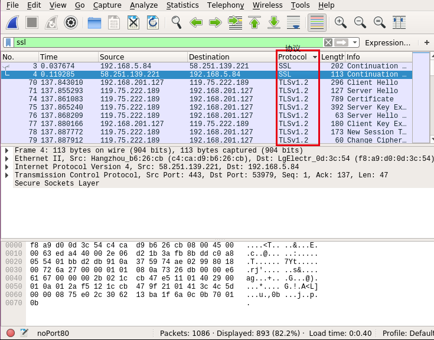

# 通信协议安全_1

## 一、主要工具
1. tcpdump 执行文件
    - 作用：抓包
2. wireshark
    - 作用：分析 tcpdump 的输出。

## 二、tcpdump 基本使用
### 2.1、tcpdump 针对用途
tcpdump -X -n -s 0 port 443 -w filename.pcap

- -X    
    当分析和打印时, tcpdump 会打印每个包的头部数据, 同时会以16进制和ASCII码形式打印出每个包的数据(但不包括连接层的头部).这对于分析一些新协议的数据包很方便.
- -n     
    不对地址(比如, 主机地址, 端口号)进行数字表示到名字表示的转换.
- -s  snaplen    
    设置tcpdump的数据包抓取长度为snaplen, 如果不设置默认将会是68字节(而支持网络接口分接头(nt: NIT, 上文已有描述,可搜索'网络接口分接头'关键字找到那里)的SunOS系列操作系统中默认的也是最小值是96).68字节对于IP, ICMP(nt: Internet Control Message Protocol,因特网控制报文协议), TCP 以及 UDP 协议的报文已足够, 但对于名称服务(nt: 可理解为dns, nis等服务), NFS服务相关的数据包会产生包截短. 如果产生包截短这种情况, tcpdump的相应打印输出行中会出现''[|proto]''的标志（proto 实际会显示为被截短的数据包的相关协议层次). 需要注意的是, 采用长的抓取长度(nt: snaplen比较大), 会增加包的处理时间, 并且会减少tcpdump 可缓存的数据包的数量， 从而会导致数据包的丢失. 所以, 在能抓取我们想要的包的前提下, 抓取长度越小越好.把snaplen 设置为0 意味着让tcpdump自动选择合适的长度来抓取数据包.

### 2.2、针对代码

tcpdump -s 0 -i eth0 -w /sdcard/Download/dump.pcap "tcp and (((ip[2:2] - ((ip[0]&0xf)<<2)) - ((tcp[12]&0xf0)>>2)) != 0)"

nohup COMMAND > /dev/null 2>&1 &

### 2.3、wireshark 针对使用
#### 2.3.1、一个误区需要探究
将抓包文件 .pcat 文件交给 wireshark 处理：

- 

在 Protocol 列中是不存在 HTTPS 字样的存在 SSL 。我们需要深究一下 HTTP & SSL

HTTP 和 SSL/TLS 的合体称为 HTTPS

SSL/TLS 也可以和别的协议合体的，所以我们 Wireshark 通过 Protocol 来筛选 SSL 不能满足对 HTTPS 的需求。

### 2.4、tcpdump | wireshark 共同使用
并非任意的 tcpdump 命令抓到的包都可以被 wireshark 解析。

通过重定向(` > `)写到文件中的内容多次尝试均无法被 wireshark 识别，提示：
```tip
The capture file appears to be damaged or corrupt.
(vwr: Invalid data length 7551520 (runs past the end of the record))
```

针对上述问题使用 `-w` 命令可以得到很好的解决。

## 三、检测思路
通过 tcpdump 命令来完成检测点判定

前提是要做到机器中只有测试应用可以通过 443 | 80 端口 发送网络请求。

### 3.1、检测 https 

思路是发现存在 HTTPS 网络请求我们就认为安全

关键命令 `tcpdump 'tcp port 443' > /sdcard/Download/tcpPort443.txt ` 注意结果中的 __https__ 字样。
- 实际上是替换了 443 字样 
    ```terminal
    ······
    10:21:05.770046 IP 119.75.222.189.https > 192.168.201.102.48548: Flags [P.], seq 102:108, ack 518, win 492, length 6
    10:21:05.770174 IP 192.168.201.102.48548 > 119.75.222.189.https: Flags [.], ack 108, win 1369, length 0
    10:21:05.770358 IP 119.75.222.189.https > 192.168.201.102.48548: Flags [P.], seq 108:153, ack 518, win 492, length 45
    10:21:05.770474 IP 192.168.201.102.48548 > 119.75.222.189.https: Flags [.], ack 153, win 1369, length 0
    10:21:05.770621 IP 192.168.201.102.48548 > 119.75.222.189.https: Flags [P.], seq 518:569, ack 153, win 1369, length 51
    ······
    ```

### 3.2、检测 http 

思路是存在 HTTP 网络请求我们就认为风险

关键命令 `tcpdump 'tcp port 80' > /sdcard/Download/tcpPort80.txt ` 注意结果中的 __http__ 字样。
- 实际上是替换了 80 字样 
    ```terminal
    ······
    14:33:40.293179 IP 192.168.201.102.46874 > 103.235.46.18.http: Flags [.], ack 1, win 1369, options [nop,nop,sack 1 {346:347}], length 0
    14:33:40.295428 IP 192.168.201.102.46874 > 103.235.46.18.http: Flags [.], ack 347, win 1386, length 0
    14:33:40.299454 IP 192.168.201.102.46874 > 103.235.46.18.http: Flags [F.], seq 761, ack 347, win 1386, length 0
    ······
    ```

### 3.3、误报
1. 当只检测 HTTPS 的时候，我们无法认定应用是否在关键数据传输使用了它
2. 当只检测 HTTP 的时候，我们无法认定应用是在进行无需加密的数据传输
3. 对于敏感数据大文件的最优传输方式是通过对称加密 HTTP 传输加密内容 HTTPS 传输秘钥。

### 3.4、总结
如果只检测 HTTP 我们做的事情实际上是：
- 通知开发者如果你的数据是私密数据请确保它使用 HTTPS 传输。
- 我们只能能认为他的操作可能存在风险。
如果只检测 HTTPS 我们做的事情实际上是：
- 即使它使用了 HTTP 传输敏感信息我们也无法提醒他什么。

所以我们通过检测 HTTP 来做吧。


## 参考
1. [Linux tcpdump命令详解](http://www.cnblogs.com/ggjucheng/archive/2012/01/14/2322659.html)