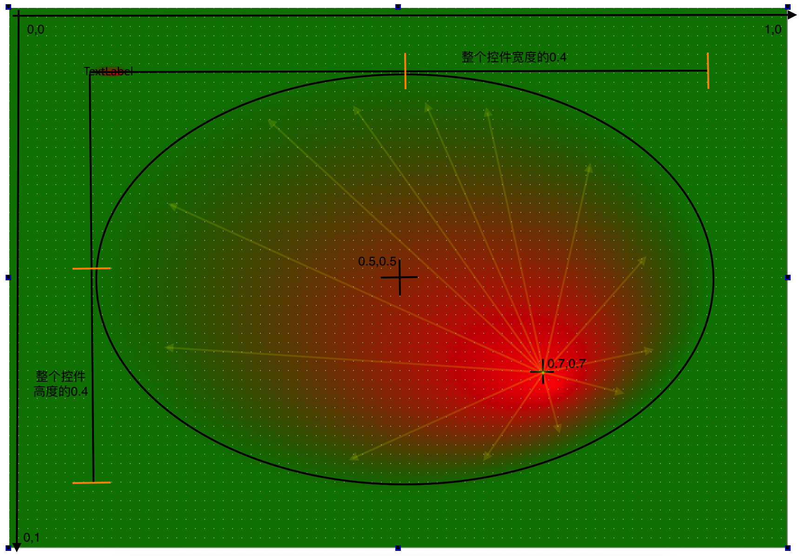

线性渐变理解

```css
qlineargradient (
  spread:pad, 
  x1:0, y1:0, x2:0, y2:1, 
  stop:0 rgba(0, 0, 0, 255),  
  stop:1 rgba(255, 255, 0, 255)
)

x1 表示第一个坐标的 x 值为 0 ; 
x2 表二第二个坐标的 x 值为 0 ;
y1 表示第一个坐标的 y 值为 0 ;
y2 表二第二个坐标的 y 值为 1 ;

x1, x2, y1, y2 的值是百分比 : 0 表示 0% ; 1表示 100%

渐变是在一条直线上发生 , 
- 这条直线的起始点为 (horizontalPixel * x1 , verticalPixel * y1)
- 这条直线的终止点为 (horizontalPixel * x2 , verticalPixel * y2)

# ┌────────┐      # ┌────────┐
# │x       │      # │x       │
# │ x      │      # │ x      │
# │  x     │      # │  x     │
# │   x    │      # │   x    │
# │    x   │      # │        │
# │     x  │      # │        │
# │      x │      # │        │
# │       x│      # │        │
# └────────┘      # └────────┘

矩形的渐变直线如果小于控件对角线 , spread 可能就该发挥作用了
```


径向渐变理解

```css
background: qradialgradient(
    spread:repeat,
    cx:0.5, cy:0.5, radius: 0.4,
    fx:0.7, fy:0.7, 
    stop:0 red, 
    stop:1 green)
```

