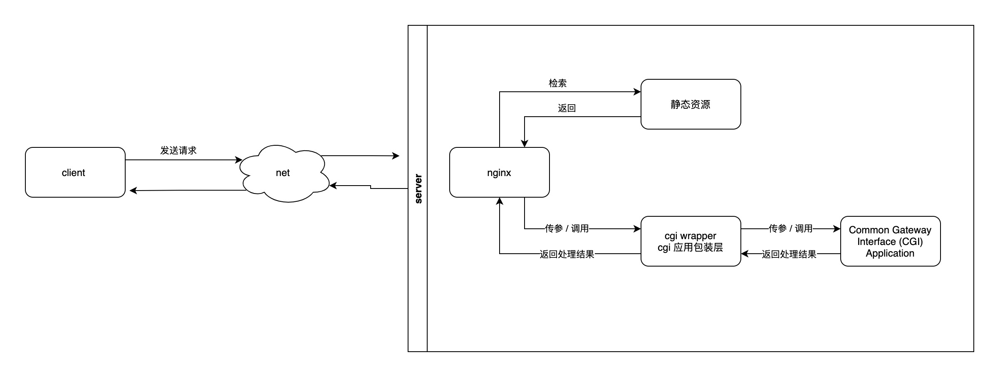

## 0x01. CGI / nginx 结合将远程请求分发到后端应用



节点释义
- client : 客户端 , 可以假定为 浏览器
- net : 网络 , 可以理解为网线
- server : 网页服务器 , 服务器硬件 或 服务器软件 或 二者的统称 [维基释义](https://zh.wikipedia.org/wiki/網頁伺服器) [IBM 释义](https://zh.wikipedia.org/wiki/網頁伺服器)
- nginx : web server application (一个提供网页的服务器程序)
- 静态资源 : nginx 可以直接解析 uri , 并通过简单的配置访问服务器磁盘中的静态文件
- cgi application : 有些情况下 , uri 请求 携带请求参数 , 请求结果需要根据参数进行计算取得 , 这些计算动作 , 需要运行于本地(也可以是远程)的应用程序进行 . 

  nginx 实现了 Fast Common Gateway Interface(CGI 的一种) , 来协助完成调用本地应用程序的动作 . 
  
  Common Gateway Interface(CGI) : 通用网关协议

  `negix` 和 `CGI Application` , 是达成协议的双方 . 

  达成协议的双方还需要一个使者 , 帮助双方在遵守协议的基础上完成通信 . 这个使者就是 `cgi wrapper`


## 0x02. web server  :  
[nginx](http://nginx.org/)  /  Apache HTTP Server  /  ...
          

## 0x03. CGI Wrapper 也有多种 : 
- spawn-fcgi 
  - 项目相关信息：https://redmine.lighttpd.net/projects/spawn-fcgi/wiki
  - [最初是 lighttpd 的子项目 , 后来抽取出来单独维护了](http://blog.lighttpd.net/articles/2009/02/18/prerelease-of-spawn-fcgi-1-6-0-rc1-r16/)
- [FCGI Wrap , Nginx 提供的 CGI Wrapper 脚本 , 查看它的代码发现脚本调用的也是 spawn-fcgi](https://www.nginx.com/resources/wiki/start/topics/examples/fcgiwrap/)


## 0x04. CGI
Common Gateway Interface (CGI) 通用网关接口
  - [FastCGI](https://zh.m.wikipedia.org/zh-hans/FastCGI)
  - Simple Common Gateway Interface (scgi)
    - https://zh.wikipedia.org/zh-hans/简单通用网关接口
    - https://zh.m.wikipedia.org/zh-hans/简单通用网关接口

这个接口由 web 容器(例如 Nignx) 和 cgi 应用共同遵守 ； CGI 协议这部分在不同项目里的需求是大致相同的 , 所以被前人抽取成库 。 这些库只包含了cgi 规范的逻辑代码 ， 不同的业务对这部分需求是相同的 。 接下来我们要了解下现存的 cgi 库都有那些


fastcgi / libfcgi-dev ： https://packages.debian.org/zh-cn/stretch/libfcgi-dev
- 这个库现存的介绍在 ： https://fastcgi-archives.github.io/
    - 以前的网站已经不可用了 ：http://www.fastcgi.com/
- [这是实际的说明书 ， 关于函数使用业务逻辑需要观察代码了估计](http://fastcgi-archives.github.io/fcgi2/doc/overview.html)
    - 实际说明书来自 github 仓库 : https://github.com/FastCGI-Archives/fcgi2
- [FastCGI 规范](http://www.mit.edu/~yandros/doc/specs/fcgi-spec.html)

`fastcgi++` / `fastcgipp` : https://github.com/eddic/fastcgipp
- 写过 demo ， 对于 post 的支持我不太会用 ，所以没有采用它

还有其他更多的 cgi 库 ， 可以从以下几个路径找到
- `google 搜索` 
- `https://sourceforge.net/ 搜索` 
- `https://www.gnu.org/ 搜索`
- https://fastcgi-archives.github.io/ 文字搜索


事实上我的学习路径是 先尝试了 fastcgi++ , 发现文档缺失 ，post 能力不知道如何使用 。 

后来找到了 [cgicc](http://gnu.ist.utl.pt/software/cgicc/cgicc.html) 在使用 cgicc 的时候 ， 我发现
cgicc 使用了 `libfcgi-dev` 。 

CGICC 的相关文档 ：
1. https://www.gnu.org/software/cgicc/
2. https://www.gnu.org/software/cgicc/manual/
3. https://www.gnu.org/software/cgicc/doc/index.html


要完成后续编码 , 我们需要两个库的代码文档 `fastcgi` / `cgicc`
  - cgicc 提供了一些(HTML)文档编辑的能力 , `fastcgi` 的能力是用的 [`fastcgi`](https://packages.debian.org/zh-cn/stretch/libfcgi-dev)
  - 安装 fastcgi : `apt-get install libfcgi-dev`
  - 安装 cgicc : `apt-get install libcgicc-dev`

通过 fastcgi 将 http response 发送给 nginx , 报文格式需要保证正确; https://www.tutorialspoint.com/http/http_responses.htm
```json
Status: 200                                    # A Status-line
Content-type:application/json; charset=utf-8   # Zero or more header (General|Response|Entity) fields followed by CRLF
PID:457
                                               # An empty line (i.e., a line with nothing preceding the CRLF) 
indicating the end of the header fields
{                                              # Optionally a message-body
  "data": "",
  "externalMsg": "",
  "internalMsg": "",
  "status": 200,
  "statusDesc": "解析完成"
}

```


## 0x05. 整体逻辑串联

服务器上安装软件
1. nginx 
2. CGI Wrapper : spawn-fcgi 
3. 实现了 cgi 接口的程序 : progress


启动 nginx , 配置好 progress 文件路径

启动 spawn-fcgi 完成对 , 并绑定 progress 

```
# '-n' No forking should take place (for daemontools) , 可以展现程序执行过程

spawn-fcgi \
           -a 127.0.0.1  \
           -p 9000 
           -f /document/c_cpp_program/cpp_spider/demo/contrib/support_cgicc_test.run
           -d /mount_point/data/_document/c_cpp_program/nameless_carpool/tmp_dir/run_path
           -n
```


spawn-fcgi 运行失败 : `spawn-fcgi: child exited with: 127`
- 可以先检查如果不通过 spawn-fcgi 运行程序的话 , 程序能否运行成功 . 
- 运行程序缺少动态库 : `ldd /mount_point/data/_document/c_cpp_program/nameless_carpool/build/NamelessCarpool.run`
- https://blog.51cto.com/yang/2899974


## 参考
- [nginx fastcgi C++ 开发框架配置说明](http://www.4k8k.xyz/article/dizuo/8622974)


## 0x02. 后端应用是如何完成数据处理的 ?


