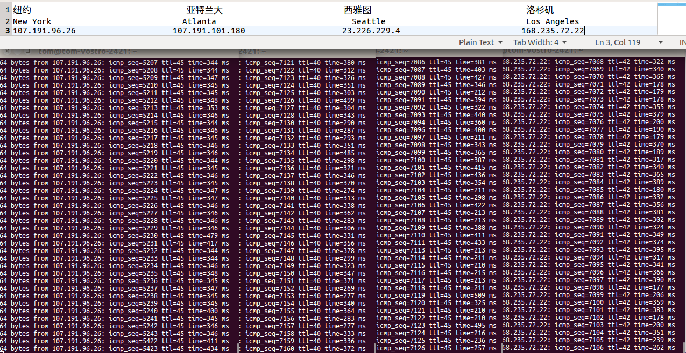

# 初始化个人专用网络
## 一、 VPS 选购
### 1.1、 名词解释
1. CN2
    - CN2，中国电信下一代承载网（ChinaNetNextCarryingNetwork）。
2. OpenVZ
    - 性能高，但是在服务商超售的情况下会造成性能急剧下降。
3. XEN
    - 在 OpenVZ 不超售的情况下 KVM 的性能劣于前者。(OpenVZ 超售则反之)
    - Xen-PV：半虚拟化，所以它仅仅适用于linux系列VPS，但它的性能损失比较少，大概相对于母机的4%-8%左右。
    - Xen-HVM：全虚拟化，可以安装windows或自由挂载ISO文件安装任意系统，由于是全虚拟化，所以性能损失较大，大概相对于母机性能损失8%-20%左右。
4. KVM
    - 优势：和xen类似，比xen更好的点是，kvm是完全虚拟的，所以不分pv和hvm的区别，所有的kvm类+型的虚拟技术都可以装各种linux的发行版和各种win的发行版，不管供应商在主页有没有写明是否支持win，只要你配置够win运行，那就肯定可以装+的上去，只是方法的问题而已。
    - 劣势：恰恰因为kvm可以装任意类型的操作系统，导致了折腾帝甚至在128m的机器上装了win2003（上去+后直接所有的cpu和内存都用于硬盘IO了，不明白这些人想干神马）。其结果就是所有的kvm邻居都得看你周围邻居的脸色。这么说把，个node下只要+有5、6台这种折腾帝，对不起，你的硬盘基本就是石头盘了。

5. __小结：__ 有人就有风险，人就是风险。所以如果有的选的话我心中的优先级
    - XEN
    - KVM
    - OpenVZ

### 1.2、 价格
|搬瓦工 Bandwagonhost           | vultr         |BudgetVM    |RamNode                |RamNode(KVM)            |
|------------------------------|---------------|------------|-----------------------|------------------------|
|$4.99 USD Monthly             |$5 USD Monthly |$7.99美元/月 |                       |$3.00 USD Monthly       |
|$13.99 USD Quarterly          |               |            |                       |$8.73 USD Quarterly     |    
|$25.99 USD Semi-Annually      |               |            |                       |$17.10 USD Semi-Annually|        
|$49.99 USD Annually           |               |            |$15.00 USD Annually    |$32.40 USD Annually     |   
|                              |               |            |价格口碑尚可，暂不支持支付宝|                        |

$3.00 USD Monthly
$8.73 USD Quarterly
$17.10 USD Semi-Annually
$32.40 USD Annually

### 1.3 PayPal
不知道信不信得过我注册了一个 Paypal 账户，然后打算入手 15刀/年 的 RamNode 产品啦。

是 OpenVZ 但是便宜，我输给了价格 ^_^ 。

找到 KVM 了 ：https://clientarea.ramnode.com/cart.php

1. 如何确定那个机房适合自己？
    - 评比的方法已经有了，我们直接 ping 并比较就可行。
        - ping 一下可以看出来洛杉矶的网速对我而言最好，当然西雅图也可以，但是稍逊于洛杉矶
        - 

2. 然后支付就 OK。

## 参考 & 抄录
1. [赵荣部落](http://www.zrblog.net)
    - [本次选购活动主要依赖此文](http://www.zrblog.net/10dao)
2. [老左博客:专注美国VPS,主机评测,域名优惠码](http://www.laozuo.org/)
3. [VPS 侦探](http://www.vpser.net/)
4. [Xen、OpenVZ、KVM三大VPS技术优劣势详解](http://vps.zzidc.com/vpsjishu/452.html)
5. [搬瓦工科普：VPS虚拟化架构OpenVZ和KVM的区别](http://baijiahao.baidu.com/s?id=1565818348600972&wfr=spider&for=pc)
6. [VPS技术之如何选择VPS和判断VPS线路的好坏](http://www.cnblogs.com/wpjamer/articles/4216814.html)
7. [主机评测](http://www.cnblogs.com/wpjamer/articles/4216814.html)
8. [Vultr VPS 测评](http://www.cnvultr.com/)
9. [小七博客](https://www.xqblog.com/4435.html)
10. [老蒋部落](http://www.itbulu.com/ramnode-plan-datacenter.html)
11. [138VPS信息分享](http://www.138vps.com/cheapvps/447.html)
