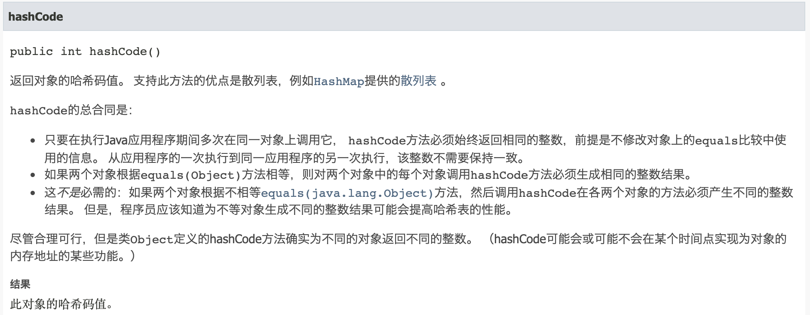
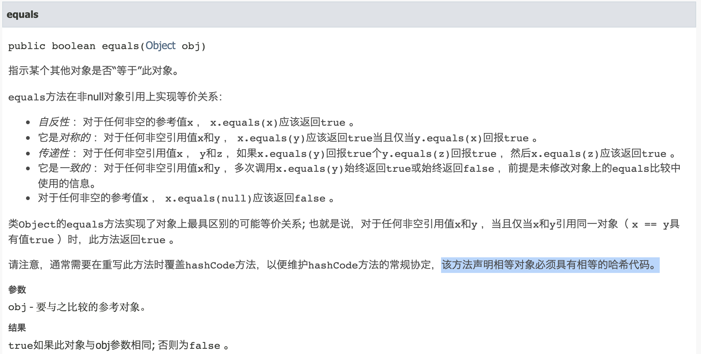

对 `object` 成员函数 `hashCode()` 和 `equals()` 的理解

## 参考 
1. [Why do I need to override the equals and hashCode methods in Java?](https://stackoverflow.com/a/2265637/7707781)
2. [Why does Java's hashCode() in String use 31 as a multiplier?](https://stackoverflow.com/q/299304/7707781)
3. https://www.cnblogs.com/szrs/p/12164982.html
4. [英文 API](https://docs.oracle.com/en/java/javase/11/docs/api/java.base/java/lang/Object.html#hashCode())
5. [中文 API](https://www.apiref.com/java11-zh/java.base/java/lang/Object.html#hashCode())


## 我们的疑问

### 1. 覆写 `hashCode()` 和 `equals()` 需要注意什么
- 
- 


### 2. `HashMap<key,value>` 中我们常说的 key 唯一是什么意思
- [对的]**key 的 hash 值唯一吗 ?**
- map 中的任意两个 key 调用 euqals 返回 false 吗 ?
    - 按照规约 , 当 equals 返回 true 的时候 , 两个对象的 hash 值必然相等


### 3. `hashCode()` 应该如何覆写

参考一下 JDK 中覆写的方式
- `Long.java`
    ```java
        /**
        * Returns a hash code for this {@code Long}. The result is
        * the exclusive OR of the two halves of the primitive
        * {@code long} value held by this {@code Long}
        * object. That is, the hashcode is the value of the expression:
        *
        * <blockquote>
        *  {@code (int)(this.longValue()^(this.longValue()>>>32))}
        * </blockquote>
        *
        * @return  a hash code value for this object.
        */
        @Override
        public int hashCode() {
            return Long.hashCode(value);
        }

        /**
        * Returns a hash code for a {@code long} value; compatible with
        * {@code Long.hashCode()}.
        *
        * @param value the value to hash
        * @return a hash code value for a {@code long} value.
        * @since 1.8
        */
        public static int hashCode(long value) {
            return (int)(value ^ (value >>> 32));
        }
    ```

- `String.java`

    ```java
        /** Cache the hash code for the string */
        private int hash; // Default to 0

        /**
        * Returns a hash code for this string. The hash code for a
        * {@code String} object is computed as
        * <blockquote><pre>
        * s[0]*31^(n-1) + s[1]*31^(n-2) + ... + s[n-1]
        * </pre></blockquote>
        * using {@code int} arithmetic, where {@code s[i]} is the
        * <i>i</i>th character of the string, {@code n} is the length of
        * the string, and {@code ^} indicates exponentiation.
        * (The hash value of the empty string is zero.)
        *
        * @return  a hash code value for this object.
        */
        public int hashCode() {
            int h = hash;
            if (h == 0 && value.length > 0) {
                char val[] = value;

                for (int i = 0; i < value.length; i++) {
                    h = 31 * h + val[i];
                }
                hash = h;
            }
            return h;
        }
    ```

- 网络上流传的写法
    ```java
        @Override public int hashCode() {
            final int prime = 31;
            int result = 1; /*这里的值比较随意*/
            result = prime * result + ((importantField == null) ? 0 : importantField.hashCode());
            return result;
        }
    ```


- 至此产生一个问题 , 为什么偏偏是 `31` ?
    - [试验结论是用是用 `31` 做这个计算得到 不同对象 得到相同 hash 值的概率较低](https://stackoverflow.com/a/300111/7707781)


- **以下追问暂时停止 , 且没有得出结论**

- hash 值重复的概率较低是什么意思?  
    - 就是可能会重复 , 那目前在 SDK 中有哪些地方存在这种可能以及如何解决的呢 ?


- hash 重复会发生什么 ?
    - 对于 map 的操作会发生逻辑意外


- List.equals 对比的是什么 ?
    `AbstractList.equals()` , 显示是逐个调用列中元素的 equals ;
    ```java
        /**
        * Compares the specified object with this list for equality.  Returns
        * {@code true} if and only if the specified object is also a list, both
        * lists have the same size, and all corresponding pairs of elements in
        * the two lists are <i>equal</i>.  (Two elements {@code e1} and
        * {@code e2} are <i>equal</i> if {@code (e1==null ? e2==null :
        * e1.equals(e2))}.)  In other words, two lists are defined to be
        * equal if they contain the same elements in the same order.
        *
        * @implSpec
        * This implementation first checks if the specified object is this
        * list. If so, it returns {@code true}; if not, it checks if the
        * specified object is a list. If not, it returns {@code false}; if so,
        * it iterates over both lists, comparing corresponding pairs of elements.
        * If any comparison returns {@code false}, this method returns
        * {@code false}.  If either iterator runs out of elements before the
        * other it returns {@code false} (as the lists are of unequal length);
        * otherwise it returns {@code true} when the iterations complete.
        *
        * @param o the object to be compared for equality with this list
        * @return {@code true} if the specified object is equal to this list
        */
        public boolean equals(Object o) {
            if (o == this)
                return true;
            if (!(o instanceof List))
                return false;

            ListIterator<E> e1 = listIterator();
            ListIterator<?> e2 = ((List<?>) o).listIterator();
            while (e1.hasNext() && e2.hasNext()) {
                E o1 = e1.next();
                Object o2 = e2.next();
                if (!(o1==null ? o2==null : o1.equals(o2)))
                    return false;
            }
            return !(e1.hasNext() || e2.hasNext());
        }
    ```


