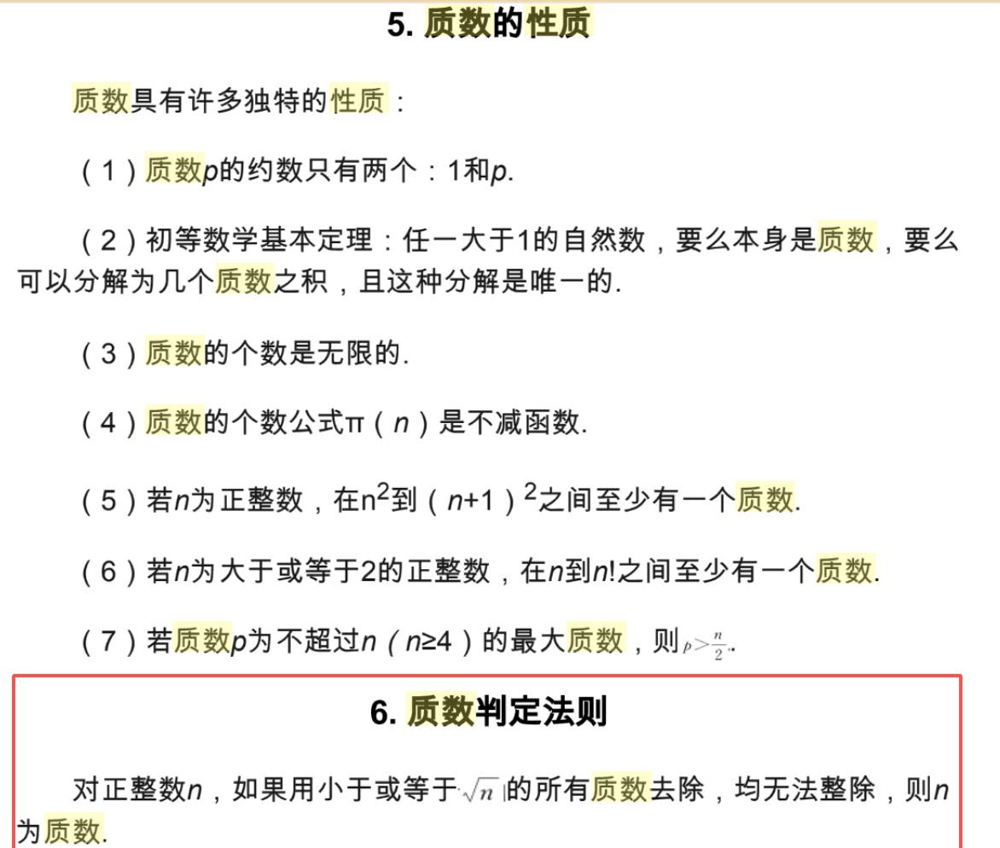

## 0x00. 题目内容

统计所有小于非负整数 n 的质数(素数)的数量。

示例:
```
输入: 10
输出: 4
解释: 小于 10 的质数一共有 4 个, 它们是 2, 3, 5, 7 。
```

## 0x01. 超时算法
```java
class Solution {
    
    /**
    失败的算法计算 超时 .
       要解决超时应该尝试缩短循环次数

    质数 : 大于 1 的自然数 如果只能被 1 和其本身整除 , 这个数就是质数
    时间复杂度 : O(n^2)
        两个 for 循环  , 两次的循环次数均与 n 相关 , 两个 for 循环式嵌套调用 , 因此时间复杂度为 O(n^2)
    空间复杂度 : O(1)
        创建的变量只有两个(整数个) , isPrimeNumber 虽然被多次调用 , 但是销毁重建 , 占用内存一直是常数 , 所以空间复杂度为常数
    
    */
    
    public int countPrimes(int n) {
        
        int result = 0;
        
        for(int i = 2 ; i < n ; i++){
            if(isPrimeNumber(i)){
                result ++;
            }
        }

        return result;
    }
    
    public boolean isPrimeNumber(int number){
        int flag = 2;
        
        while(flag < number){
            if(number % flag == 0){
                return false;
            }
            flag ++;
        }
        
        return true;
    }
}
```

## 0x02. 尝试优化

[这种优化方式有人说管用](https://blog.csdn.net/afei__/article/details/80638460)

需要先了解 质数(素数) 的相关性质
- 

有了这图还质数判定方式还不够 , 还需要证明使用该判定方式 , 能降低时间复杂度这个优化才是有说服力的.

先改写算法

```java
    public boolean isPrimeNumber(int number){
        int flag = 2;
        
        int sqrt = Math.sqrt(number)
        while(flag <= sqrt){
            if(number % flag == 0){
                return false;
            }
            flag ++;
        }
        
        return true;
    }

    /* 使用 Math.sqrt() 函数我们无法准确计算时间复杂度 , 所以需要了解开方算法的实现 
        调用栈太深 卡壳 了
    */

```
