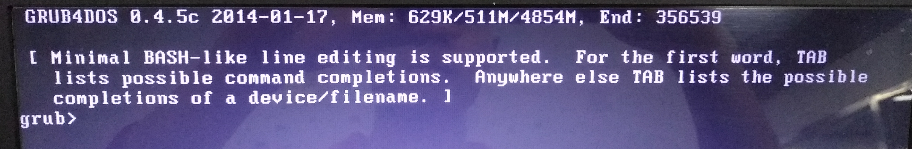

# Legacy_UEFI_异同

1. Dell Vostro 2421
2. 机械(Win) + 光驱SSD(Linux) 双硬盘
3. 先安装 Win 后安装 Linux grub2 放在SSD

状况：
- 上述安装过程均在在 Legacy 模式下进行，安装完成之后，通过 EasyBCD 添加引导项，无法启动 Ubunut 系统。表现形式如下
    - 
    - 并且在 grub4doc 下只能发现并操作机械硬盘;无法发现并使用 SSD(光驱位)。

- 尝试切换为 UEFI 模式：整个世界都清静了。
    - 是的,我的问题是：这是为什么？

## 唉，
止不住有点烦躁，毕竟周五了 ^_^ 。 