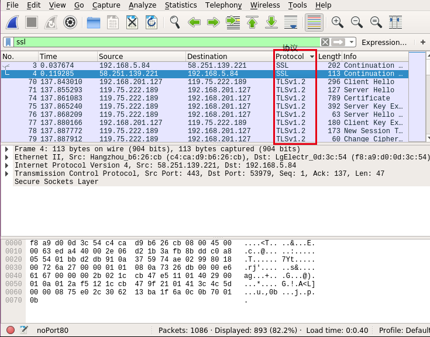

## 一、tcpdump 工作在协议栈的那一层
Linux 下抓取报文的位置，是在链路层处理报文之后，交给网络层之前的位置。具体看一下内核代码 net/core/dev.c 就可以了

这个理解应该还不够完善，因为通信是一来一回的，上述只说明了抓包机器接收数据包的情况下 tcpdump 在哪里工作(暂认为发送数据包也工作在相同的位置吧)。

## 二、wireshark 使用
### 2.1、一个误区需要探究
将抓包文件 .pcat 文件交给 wireshark 处理：

- 

在 Protocol 列中是不存在 HTTPS 字样的存在 SSL 。我们需要深究一下 HTTP & SSL

HTTP 和 SSL/TLS 的合体称为 HTTPS

SSL/TLS 也可以和别的协议合体的，所以我们 Wireshark 通过 Protocol 来筛选 SSL 不能满足对 HTTPS 的需求。

## 三、tcpdump | wireshark 共同使用
并非任意的 tcpdump 命令抓到的包都可以被 wireshark 解析。

通过重定向(` > `)写到文件中的内容多次尝试均无法被 wireshark 识别，提示：
```tip
The capture file appears to be damaged or corrupt.
(vwr: Invalid data length 7551520 (runs past the end of the record))
```

针对上述问题使用 `-w` 命令可以得到很好的解决。


## 参考
1. [OSI七层与TCP/IP五层网络架构详解](https://www.2cto.com/net/201310/252965.html)
    - [OSI七层与TCP/IP五层网络架构详解](http://blog.csdn.net/huangjin0507/article/details/51613561)
2. [[硬件及驱动] tcpdump 工作在协议栈的那一层？](http://bbs.chinaunix.net/thread-4080795-1-1.html)
3. [TCPDUMP](https://baike.baidu.com/item/TCPDUMP/1383003?fr=aladdin)
4. [协议栈](https://baike.baidu.com/item/协议栈/3155224?fr=aladdin)
5. [聊聊HTTPS和SSL/TLS协议](http://www.techug.com/post/https-ssl-tls.html)
    - 原址：[編程隨想](http://program-think.blogspot.com/2014/11/https-ssl-tls-1.html)
6. [443端口](https://baike.baidu.com/item/443端口/4831343?fr=aladdin)