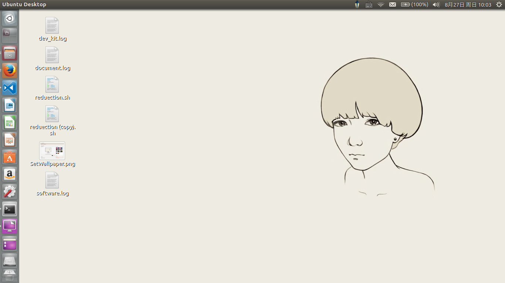
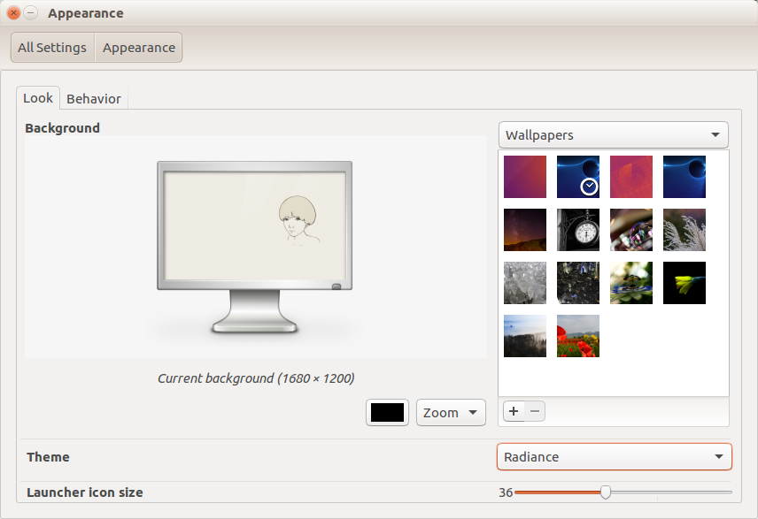

## 一、文件管理器
1. 需求：默认列表显示、显示隐藏文件、显示文件权限
    1. 做法：打开文件管理器->左上角->Edit->Preference->做你想做的->重启文件管理器
    2. ^_^

## 二、Wallpaper：壁纸
>桌面这个样子我感觉就很不协调，黑色和米色无论如何都感觉不搭。



>调整下图的右下角下拉框就OK。




## 二、 开机自动挂载磁盘

设备环境 Win10、Ubuntu 双系统，双硬盘，Ubuntu 和 要挂载的分区在分别在两块硬盘(别忘了取消 Win10 的快速启动)。

### 2.1、 预备 **/etc/fstab**

可能玩Linux的朋友都知道fstab这个文件，如果要用好linux，熟悉linux的一些核心配置文件是必要的，而fstab则是其中之一。这个文件描述系统中各种文件系统的信息，应用程序读取这个文件，然后根据其内容进行自动挂载的工作。因此，我们需要理解其中的内容，了解它如何与 mount命令配合工作，并能够针对自己的情况进行修改。 

作为系统配置文件，fstab通常都位于/etc目录下，它包括了所有分区和存储设备的信息，以及它们应该挂载到哪里，以什么样子的方式挂载。如果遇到一些类似于无法挂载你的windows分区阿，无法使用你的光驱阿，无法对某个分区进行写入操作阿什么的，那么基本上可以断定，你的fstab内容有问题了。也就是说，你可以通过修改它来搞定这些问题，而不用去论坛冰天雪地裸体跪求答案了。 

说了半天，/etc/fstab其实就是一个文本文件，用gedit或者vi都可以打开，当然，前提是root权限。在这个文件中，每个文件系统（包括分区或者设备）用一行来描述，在每一行中，用空格或TAB符号来分隔各个字段，文件中以*开头的行是注释信息。Fstab文件中的纪录的排序十分重要。因为 fsck，mount或umount等程序在做它们的工作时会按此顺序进行本。下面进行详细的讲解，本文假设读者已经有挂载文件系统和分区的基础知识。 

在讲解之前要说一下，每个人所使用的系统情况都是不同的，包括硬件种类，所用系统等，因此fstab文件肯定是有所差异的。但是其基本结构，如上所述，都不会变。所以我们先以一个fstab内容作为模板进行讲解。 

首先请看下面这个例子： 
```
/dev/hda2   /               ext2 defaults               1 1 
/dev/hdb1   /home           ext2 defaults               1 2 
/dev/cdrom  /media/cdrom    auto ro,noauto,user,exec    0 0 
/dev/fd0    /media/floppy   auto rw,noauto,user,sync    0 0 
proc        /proc           proc defaults               0 0 
/dev/hda1   swap            swap pri=42                 0 0 
```

这些看起来毫无意义的字符代表了什么？在对应相应分区或者存储设备信息的每一行中，每一列又是什么意思？先大体讲一下，第一列表示设备的名称，第二列表示该设备的挂载点，第三列是文件系统，第四列是挂载选项，第五列是dump选项（用一个数字表示），第六列（接下来的数字）表示文件系统检查选项。好了，接下来，就要详细介绍这些参数的具体含义了。 

##### 第一、二列：设备和默认挂载点 


说实话，第一列和第二列的内容是最简单最直接的，它们的作用就是告诉mount命令，我想挂载什么分区或者什么设备，以及我所希望的挂载点在哪里。在fstab中为某一个设备指定的挂载点是其默认挂载点，也就是当你在挂载目录的时候没有手工指定其他目录的话，系统就将该设备挂载到这个目录。大多数 Linux发行版都会为挂载点创建专门的目录，大多数是在/mnt下，但是一些发行版（比如SUSE或者ubuntu）是在/media下。笔者使用的是 ubuntu，所以示例信息中也是用的/media目录。 

按照我们给出的fstab示例，如果你敲入命令 
```
$ mount /dev/fd0 
```

你的软驱就将挂载到/media/floppy，因为这是你告诉系统的软驱默认挂载点。如果没有这个信息，当你敲入mount命令时，mount会感到很困惑：该死的，你想让我把这玩意挂载到哪里去呢？当然，如果你看fstab中发行版给你指定的默认挂载点不顺眼，也可以自由修改它，修改成任何一个你希望的目录都可以。如果还不存在，就首先创建这个目录。要知道，fstab是不会把所有工作都给你包干的哦。 

另外，有一些分区和存储设备是在Linux系统启动的时候就自动挂载的，比如，让我们看看刚才列出来的fstab示例信息，有两行是这样的： 
```
/dev/hda2 /     ext2 defaults 1 1 
/dev/hdb1 /home ext2 defaults 1 2 
```
正如刚才我们讲到的那样，这两行表示/dev/hda2默认挂载到/根目录，而 /dev/hdb1则默认挂载到/home目录，。这些工作在你Linux系统启动的时候就会通过读取fstab自动完成，否则的话……想象你会遭受什么样的折磨吧，所有的程序都在/根目录下，而你却无法使用，因为你没有挂载/根目录！恩，我保证，这将是一次让人沮丧的系统使用经历。 

除了显示的使用设备名，你可以使用设备的UUID或设备的卷标签，例如，你可以在这个字段写成“LABAL=root”或“UUID= 3e6be9de- 8139-11d1-9106-a43f08d823a6”，这将使系统更具伸缩性。例如，如果你的系统添加或移除了一个SCSI硬盘，这有可以改变你的设备名，但它不会修改你的卷标签。 

对于NFS mount操作，这个字段应该包含host:dir格式的信息，例如:knuth.aeb.nl:/，对于进程文件系统procfs，使用proc。 

##### 第三列：文件系统类型 

fstab中的第三列指示了设备或者分区的文件系统类型。它支持很多种类的文件系统，我们在这里只介绍最为常用的。如果想了解你的kernel目前支持哪些文件系统，可以查看/proc/filesystems的内容。如果这个字段定义为swap，这条纪录将关联到一个用于交换目的的文件或分区。如果这个字段定义为ignored，这行将被忽略。这对于显示目前没有使用的分区非常有用。 

ext2 和 ext3： Linux下的Ext2文件系统，是 GNU/Linux 系统中标准的文件系统，其特点为存取文件的性能极好，对于中小型的文件更显示出优势，这主要得利于其簇快取层的优良设计。至于Ext3文件系统，它属于一种日志文件系统，是对ext2系统的扩展。日志式文件系统的优越性在于，它会将整个磁盘的写入动作完整记录在磁盘的某个区域上，以便有需要时可以回朔追踪。由于详细纪录了每个细节，故当在某个过程中被中断时，系统可以根据这些记录直接回朔并重整被中断的部分，而不必花时间去检查其他的部分，故文件系统检测不一致时，重整的工作速度相当快，几乎不需要花时间。 

reiserfs： ReiserFS是一个非常优秀的文件系统。也是最早用于Linux的日志文件系统之一，其机制比Ext3要先进得多，风雷小弟一直使用的就是它，很多发行版现在也把它作为默认文件系统了。可惜其作者前段时间出事了……具体情况就不说了，也不知道下一代reiserfs4还能不能出来，因为ext4都有了。 

swap： Swap，即交换区，把它想象成虚拟内存就行了。 

vfat 和 ntfs：一看就知道是Windows分区格式了，呵呵。98，me等系统都是使用的vfat，也就是最流行的fat32格式，而NT系列则多使用NTFS，当然也不是固定的，因此2000或者XP系统要具体情况具体分析。当初Linux对NTFS的写入支持不好，所以大多数资料都建议用户使用vfat格式，但是现在支持已经很好了，即使不重新编译内核，也可以通过ntfs-3g来进行写入支持（具体方法请参考这篇文章），因此不用太在意这个了。 

auto：当然，这不是一个文件系统类型。auto只是表示，文件系统的类型将被自动检测。在上面的示例中，你会发现软驱和光驱的文件系统类型都是auto，为什么呢？因为它们的文件系统类型随时都可能改变，比如软驱，优盘这种设备，可能今天是vfat格式，明天你就把它格式化成了ntfs，因此，最明智的做法就是告诉系统，我没法确定这东西的当前类型，还是你自己检测吧。 

udf： 由于刻录光驱越来越流行，现在很多发行版自带的fstab中，光驱的文件格式类型是UDF，UDF是Universal Disc Format的缩写，与ISO 9660格式相容。它采用标准的封装写入技术（PW，Packet Writing）将CD-R/CD-RW当作硬盘使用，用户可以在光盘上修改和删除文件。利用UDF格式进行刻录时，刻录软件将数据打包，并在内存中临时建立一个特殊文件目录表，同时接管系统对光盘的访问。 

iso9660： 很多光驱也使用的这个选项。ISO9660是一种描述适合CD盘片的电脑文件结构的国际标准。采用此标准的盘片可以在不同的操作系统上使用，如MAC和Windows。 

##### 第四列：挂载选项 

fstab中的第四列表示设备或者分区所需要的挂载选项。这一列也是fstab中最复杂最容易出错的一列，当然，只要你能知道一些最常用的选项是什么意思，就可以让你从头疼中解脱出来。如果要把可用的选项一项一项介绍……恩，我估计我会写到明天，所以，我还是只是分析最常用的一些选项，如果你想知道更多的东西，还是求助于man吧。 

auto 和 noauto： 这是控制设备是否自动挂载的选项。auto是默认选择的选项，这样，设备会在启动或者你使用mount -a命令时按照fstab的内容自动挂载。如果你不希望这样，就使用noauto选项，如果这样的话，你就只能明确地通过手工来挂载设备。 

user 和 nouser：这是一个非常有用的选项，user选项允许普通用户也能挂载设备，而nouser则只允许root用户挂载。nouser是默认选项，这也是让很多 Linux新手头疼的东西，因为他们发现没有办法正常挂载光驱，Windows分区等。如果你作为普通身份用户遇到类似问题，或者别的其他问题，就请把 user属性增加到fstab中。 

exec 和 noexec： exec允许你执行对应分区中的可执行二进制程序，同理，noexec的作用刚好相反。如果你拥有一个分区，分区上有一些可执行程序，而恰好你又不愿意，或者不能在你的系统中执行他们，就可以使用noexec属性。这种情况多发生于挂载Windows分区时。exec是默认选项，理由很简单，如果 noexec变成了你/根分区的默认选项的话…… 

ro： 以只读来挂载文件系统。 

rw： 以可读可写的属性来挂载系统。 

sync 和 async：对于该文件系统的输入输出应该以什么方式完成。sync的意思就是同步完成，通俗点讲，就是当你拷贝一个东西到设备或者分区中时，所有的写入变化将在你输入cp命令后立即生效，这个东西应该立马就开始往设备或者分区里面拷贝了。而如果是async，也就是输入输出异步完成的话，当你拷贝一个东西到设备或者分区中时，可能在你敲击cp命令后很久，实际的写入操作才会执行，换句话说，就是进行了缓冲处理。 

有时候这种机制蛮不错的，因为sync会影响你系统的运行速度，但是这也会带来一些问题。想一想，当你希望将一个文件拷贝到u盘上时，你执行了cp 命令，却忘记执行umount命令（它会强行将缓冲区内容写入），那么你拷贝的文件实际上并没有在u盘上面。如果你是使用的mv命令，而你又很快将u盘拔出……恭喜你，文件会从这个星球上消失的。因此，虽然async是默认属性，但是对于u盘，移动硬盘这种可移动存储设备，最好还是让他们使用sync选项。 

defaults： 所有选项全部使用默认配置，包括rw, suid, dev, exec, auto, nouser, 和 async。 

一般用户没有特殊需求，直接使用defaults就可以了。看完介绍，我们再回过头去看看前面的示例内容，以光驱为例，主要关注挂载选项这里，可以看到，光驱和其他分区设备的不同是ro，因为普通光驱是只读的。而exec则让你可以从光驱上直接执行某些程序。 

##### 第五、六列：dump和fsck选项 

Dump和fsck？这是什么东西？恩，dump是一个备份工具，而fsck是一个文件系统扫描检查工具。我不会在这里详细介绍它们，因为用man或者google都可以获得更加详细的信息。 

fstab的第五列是表示dump选项，dump工具通过这个选项位置上的数字来决定文件系统是否需要备份。如果是0，dump就会被忽略，事实上，大多数的dump设置都是0。而第六列是fsck选项，fsck命令通过检测该字段来决定文件系统通过什么顺序来扫描检查，根文件系统/对应该字段的值应该为1，其他文件系统应该为2。若文件系统无需在启动时扫描检查，则设置该字段为0。

### 2.2、 预备 **blkid**
```
$ sudo blkid
[sudo] password for tom: 
……
/dev/sda5: LABEL="document" UUID="FF4F6692E35950CE" TYPE="ntfs" PARTLABEL="Basic data partition" PARTUUID="d5bc60ca-b049-4ca0-9428-a9b9efd59371"
分区位置       分区标签         UUID                      分区类型      

……
```

### 2.3、 实施
首先查看默认挂在的位置
```
$ df -h
……
/dev/sda5        51G   25G   26G  50% /media/tom/document
```

我们自动挂载也挂载到该位置(先创建该目录)
```
$ mkdir /media/tom/document
```

为避免分区标签被更改时候出现异常，我们使用 uuid 来作为分区的标示，所以我们可以在 `/etc/fstab` 文件末尾添加如下字段
```
//可行？—√
UUID=FF4F6692E35950CE /media/tom/document  ntfs    defaults    0   0

//可行？—√
/dev/sda5   /media/tom/document  ntfs    defaults    0   0

# 上面的操作只是完成了挂载 ， 但是挂载后的目录权限都是 root 的 ， 普通用户操作不方便
# 下面的示例描述了两件事
# 1. ntfs 分区如何按照逾期的权限挂载： uid/gid 不再解释  /etc/passwd 文件中有
#    fmask=113 , 实际上是让普通文件的权限为 664 
#    dmask=002 , 实际上是让普通文件夹的权限为 775 
#    我们注意到了 ， 最终的权限是 给定值 二进制 ， 三为三为 与 777 作或 操作得到的
#    这种操作只 对 ntfs 磁盘系统生效 ， 因为， ntfs 磁盘系统不记录文件权限信息 ， 所以挂载的时候要指定
# 2. 对于 ext4 文件系统 ， 已经具备了文件权限信息 ， 上述操作不生效了
#    应该 ， 进入系统后直接修改文件和自文件的权限
# 上述两点内容来自 ： https://superuser.com/a/320640
# tom 手动添加的挂载内容
UUID=405f5802-b17e-4442-9c4c-26c17daef2e3       /media/tom/space_ssd            ext4    defaults                                               0   0 # 固态硬盘末尾50G分区
UUID=FF4F6692E35950CE                           /media/tom/win_document         ntfs    defaults,utf8,gid=1000,uid=1000,fmask=113,dmask=002    0   0 # 机械硬盘 document
UUID=7cf2d13b-dda1-4e55-a59b-52987d4dc135       /media/tom/linux_software       ext4    defaults                                               0   0 # 机械硬盘 ext4 分区
UUID=1AF0C8F75F7C68E0                           /media/tom/win_vm               ntfs    defaults,utf8,gid=1000,uid=1000,fmask=113,dmask=002    0   0 # 机械硬盘 vm
UUID=541F2B8B5C08E3C3                           /media/tom/win_os               ntfs    defaults,utf8,gid=1000,uid=1000,fmask=113,dmask=002    0   0 # 机械硬盘 os 
UUID=7C5496BC836C40EB                           /media/tom/win_other            ntfs    defaults,utf8,gid=1000,uid=1000,fmask=113,dmask=002    0   0 # 机械硬盘 other

```

### 2.4、 存在问题的方案
```
//可行？——通过观察 /etc/fstab 中的磁盘挂载均为这种形式，但是我们尝试过之后失败了。
UUID=d5bc60ca-b049-4ca0-9428-a9b9efd59371    /media/tom/document  ntfs    defaults    0   0
```
设置好之后，我们 logout 是没有任何问题的但是当重新启动进入 Ubuntu 的时候无法登录提示：
```
/dev/mmcon1p5:clean,266274/1126000 files,1631498/4499960 blocks
Welcome to emergency mode! After logging in ,type "journalctl -xb" to view system logs,
"systemctl reboot" to reboot, "systemctl default" or ^D to try again to boot into default mode.
Give root password for maintenance
(or press Control-D to continue):
```
我按 Ctrl D 会重启然而没有任何作用，提示相同。

出现这个种情况只需要输入 root 密码在 /etc/fstab 文件中将本行注释掉即可。

### 2.5、 操作文件提示“只读文件系统”

使用了一段时间提示只读文件系统 ， 无法进行正常操作了。
1. 重新挂载 ： 无效
2. `sudo ntfsfix /dev/sda4` 修复后重新挂载 ： 无效 
3. 进入 Windows 系统 关闭快速启动功能 ， 问题解决了。


## 三、 设置应用自启动
1. 使用 Startup Applications Preferences (软件)进行设置(系统默认安装)。
2. 22.04 版本 ， `sudo apt-get install gnome-tweaks` 使用软甲设置 。


## 四、 系统设置为中文 
```
sudo gedit /etc/default/locale

LANG="zh_CN.UTF-8"
LANGUAGE="zh_CN:en"
LC_NUMERIC="zh_CN.UTF-8"
LC_TIME="zh_CN.UTF-8"
LC_MONETARY="zh_CN.UTF-8"
LC_PAPER="zh_CN.UTF-8"
LC_IDENTIFICATION="zh_CN.UTF-8"
LC_NAME="zh_CN.UTF-8"
LC_ADDRESS="zh_CN.UTF-8"
LC_TELEPHONE="zh_CN.UTF-8"
LC_MEASUREMENT="zh_CN.UTF-8"

LANG=en_US.utf8
LANGUAGE=en_US.utf8
LC_CTYPE="en_US.utf8"
LC_NUMERIC=zh_CN.UTF-8
LC_TIME=zh_CN.UTF-8
LC_COLLATE="en_US.utf8"
LC_MONETARY=zh_CN.UTF-8
LC_MESSAGES="en_US.utf8"
LC_PAPER=zh_CN.UTF-8
LC_NAME=zh_CN.UTF-8
LC_ADDRESS=zh_CN.UTF-8
LC_TELEPHONE=zh_CN.UTF-8
LC_MEASUREMENT=zh_CN.UTF-8
LC_IDENTIFICATION=zh_CN.UTF-8


```

## 五、 tty terminal , Ctrl+Alt+F* 触发 ， 中文菱形乱码

```shell
sudo apt-get install fbterm         # 安装 fbterm  
sudo adduser <username> video       # 将 username 加入 video 用户组 ， 
                                    # 这是因为fbterm命令要使用/dev/fb0设备，而此设备的所属是root:video
                                    # 再往下问为什么我答不上来了。

#在 .bashrc / .zshrc 文件增加代码 , 从而 在 tty 环境下启动 fbterm 
if [[ $(tty) == *tty* ]]; then
    fbterm
fi

vim ~/.fbtermrc                     # 修改字号 font-size=16 ； 修改缓存行数 history-lines=65535
```


### 5.x、 参考
1. [fbterm的配置,纯文本终端显示中文](https://blog.csdn.net/chouzhou9701/article/details/88238525)
2. [Ubuntu tty终端显示和输入汉字](https://blog.fearcat.in/a?ID=00250-2e896eb3-e511-4a15-ba9b-9ae8a21bd077)
3. [Bash 字符串匹配](https://www.cnblogs.com/sssblog/p/10273148.html)
    - [Bash 字符串匹配](https://www.jianshu.com/p/736574f9082b)
4. [centos安装fbterm,tmux ](https://www.cnblogs.com/whq5051/p/15970235.html)


## 参考内容 
1. [ubuntu开机自动挂载的ntfs硬盘的权限问题](https://www.cnblogs.com/jpfss/p/11107980.html)
2. [Mount device with specific user rights](https://superuser.com/a/320640)
3. [commend mount](https://linux.die.net/man/8/mount)