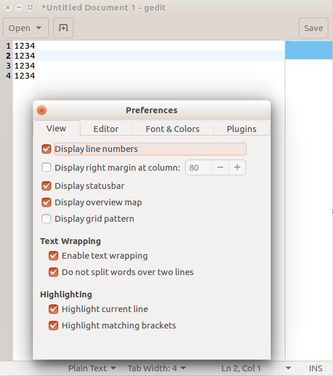

|	    类型     |软件                                                           |
|	    :--     |----------------------------                                   |
|	     IDE    |AndroidStudio / eclipse / idea / QT                            |
|	  editor    |sublime / vsCode                                               |
| vertualMachine|VMWare / Genymotion / VirtualBox                               |
|	    tool    |navicat / fiddler                                              |
|	    test    |IDA / JDGUI                                                    |
|    testnetwork|zenmap / burpsuite / xampp / DVWA                              |
|	 message    |wechat                                                         |
|	document    |wps                                                            |
|	    tool    |Chrom / Fairfox / lanten / sougouinput / KchmViewer / kingsoft |
|	    play    |SMPlayer / NeteaseCloudMusic                                   |
|	    picture |Deepin-ScreenShot / Shutter / Scrot                            |
## 一、编辑器
### 1.1、VSCode
对于没有实际打编码需求但是被各种IDE惯怀了的五好青年，相信VSCode不会让你失望。  
- VSCode到底能干什么呢？  
    - __能写博客__:支持各种语法(包含Markdown)，可以即时预览。
    - __能远程仓库__：如果你受够了各种写作平台打限制，希望能自己掌控更多，同时有不想话费到多经理，学下GIT拿起VSCode，创造你自己的世界吧。（当然了你需要apt install git）。
    - 能像你用过的IDE般舒适
    - 当然了还比较轻量。
### 1.2、VIM
你会需要它的。
如果用它编辑只读文件
1. vim 文件路径/文件名
    - 你会需要命令`:w !sudo tee %`
2. sudo vim 文件路径/文件名
    - 你只需要命令`wq`
### 1.3、WPS for Linux

### 1.4、gedit
1. 这个默认的编辑器可以很酷的 __Eidt-->Preference__ :Just do yourself。
    - 
2. 如果用它编辑只读文件
    1. gedit 文件路径/文件名
        - 你会失败
    2. sudo gedit 文件路径/文件名
        - 你会成功

## 二、浏览器
### 1.1、Firefox
1. __关于广告：__ 用了两个插件:Adblock Plus / AdBlock。

 