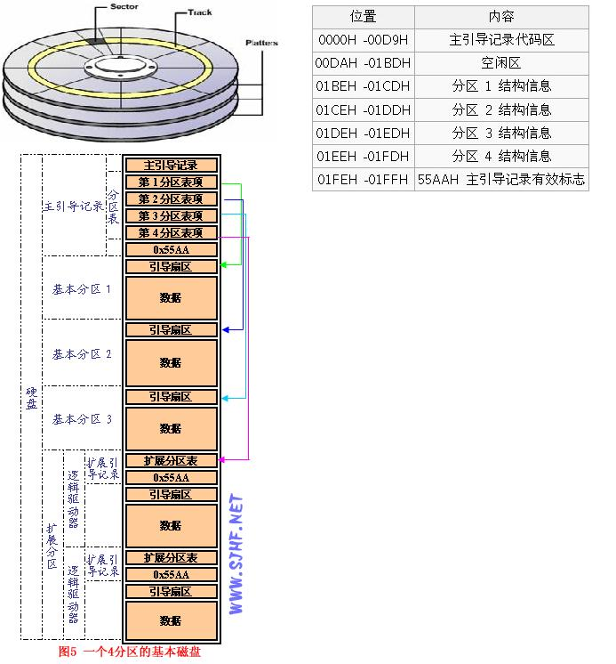

- [必须了解的预备思路](计算机启动流程.md)

1. 要明白物理分区和逻辑分区很多时候是相互交叉的
    1. 物理分区：每一个分区中有整数个硬盘。
    2. 逻辑分区：每一个分区中的硬盘个数不一定是整数。
    3. 一个物理分区有可能是一个逻辑分区。
    4. 一个逻辑分区有可能是一个物理分区。
    5. 上下文中提到的硬盘也可以用单盘片替代。

2. 物理分区
    1. 物理卷：一个物理卷指一块硬盘。
    2. 卷组：卷组是可用物理硬盘的集合，可以逻辑地看成一块大硬盘。一个卷组由一个或多个物理卷组成，最多可达32 个（AIX4.3.2 版本下该值已经增至128）。
    3. 物理分区：卷组中的物理卷划分成固定大小的块（缺省为4MB），这样的块称为物理分区。(我理解为分硬盘)
    4. 逻辑卷：每个卷组中可以定义一个或多个逻辑卷，逻辑卷是位于物理分区上的信息集合（可以是一个文件系统、调页空间、日志或转储设备空间等）。

3. 逻辑分区: X 块硬盘(X>0.0)
    1. 主分区　：在磁盘分区表(位于MBR的第447-510字节)中有索引(16Byte)并且在索引中标记为主分区的分区。  
    2. 逻辑分区：在磁盘分区表(位于MBR的第447-510字节)中有索引(16Byte)并且在索引中标记为逻辑分区的分区。
    3. 扩展分区/活动分区：尚未可知，不如问问运维的兄弟吧。

>===============================================================================================

## 1. MBR (Master Boot Record：主引导记录) ：
MBR 本身不是某一个分区，是主引导记录，引申为硬盘分区的一种模式。在这种分区模式下：一块硬盘最多只支持4个主分区或三个主分区和一个扩展分区，扩展分区下可以有多个逻辑分区。最大容量不能超过 2.1TB。

## 2. GPT (GUID Partition Table:全局唯一标识分区表)：

GPT 本身不是某一个分区，是主引导记录，引申为硬盘分区的一种模式。与MBR最大4个分区表项的限制相比，GPT对分区数量没有限制，但Windows最大仅支持128个GPT分区，GPT可管理硬盘大小达到了18EB。只有基于UEFI平台的主板才支持GPT分区引导启动。
 

任何一块 GPT 磁盘上都有一个 MSR 分区，大小岁硬盘纵容量而定，一般不超过 128MB。这个分区不能被用户直接占用，它的用途是防止将一块 GPT 磁盘接到老系统中被当做未格式化的空硬盘(造成数据损坏)。

GPT 磁盘只有做系统磁盘的时候才会有 EFI 分区，这个分区是操作系统的引导分区，与在 MBR 磁盘上安装 Win7(8) 生成的那个 100MB 分区用途相同。

## 3. ESP分区(EFI system partition:EFI系统分区)：

，该分区用于采用了EFI BIOS的电脑系统，用来启动操作系统。分区内存放引导管理程序、驱动程序、系统维护工具等。如果电脑采用了EFI系统，或当前磁盘用于在EFI平台上启动操作系统，则应建议ESP分区。

ESP是一个独立于操作系统之外的分区，操作系统被引导之后，就不再依赖它。这使得 ESP 非常适合用来存储那些系统级的维护性的工具和数据，比如：引导管理程序、驱动程序、系统维护工具、系统备份等，甚至可以在 ESP 里安装一个特殊的操作系统（SlaTaz Linux? PuppyLinux? Win PE?）。
 

## 4. MSR分区：

即微软保留分区，是GPT磁盘上用于保留空间以备用的分区，例如在将磁盘转换为动态磁盘时需要使用这些分区空间。

 
## 5. 

MSR分区即 Microsoft 保留 (MSR) 分区。是每个 GUID 分区表 (GPI) 磁盘都要求的分区。 　　系统组件可以将 MSR 分区的部分分配到新的分区以供它们使用。例如，将基本 GPT 磁盘转换为动态磁盘后，系统分配的 MSR 分区将被用作“逻辑磁盘管理器”(LDM) 元数据分区。 　　MSR 分区的大小会因 GPT 磁盘的大小不同而发生变化。对于小于 16 GB 的磁盘，MSR 分区为 32 MB。对于大于 16 GB 的磁盘，MSR 分区为 128 MB。MSR 分区在“磁盘管理”中不可见，用户也无法在 MSR 分区上存储或删除数据。

## 6. Win 查看磁盘分区方式
我的电脑 -> 右键 -> 管理 -> 磁盘管理 -> 假设选中磁盘0 -> 右击 -> 属性 -> 卷 -> 磁盘分区形式

## Reference
1. [解释MBR分区,GPT分区,EFI分区,MSR分区是什么](https://wenku.baidu.com/view/02f2889df90f76c661371a90.html)
    - http://blog.sina.com.cn/s/blog_3f3a42b50101fet8.html
1. [AIX的磁盘与文件管理](http://blog.csdn.net/hittata/article/details/6781607)
2. [硬盘结构详解_逻辑分区数量限制](http://blog.sina.com.cn/s/blog_3e3fcadd0100n8r3.html)
    - 
3. [主分区](https://baike.baidu.com/item/主分区/9816831?fr=aladdin)
4. [主引导记录](https://baike.baidu.com/item/主引导记录/7612638?fr=aladdin&fromid=10473976&fromtitle=mbr)
6. [善用EFI系统分区ESP](https://my.oschina.net/chenzhiqiang/blog/209618)