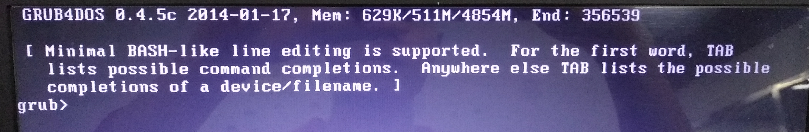

# 启动管理器
了解基础
- Windows7
- Ubunut
- 机械(Win) + 光驱SSD(Linux) 双硬盘
## 一、多系统启动流程概述
1. __BIOS__ 
    - 完成硬件自检
    -  把控制权转交给启动顺序中首个可用的设备
        - 硬盘
        - U盘
        - 光盘
        - ……
2. __硬盘__ (根据实际场景而不同)
    - 读取主引导记录(激活分区的第一个扇区)
        - 一般不把控制权先交给固定分区，而是交给事先安装的启动管理器。
    - 控制权交给启动管理器
    - 用户使用启动管理器选定并启动自己希望的操作系统。

## 二、本机的启动流程
根据观察做的总结。
1. __BIOS__ 
    - 完成硬件自检
    - 把控制权交给机械硬盘
2. __机械硬盘__
    - BootLoader ：Windows Boot Manager (Bootmgr.exe)
    - 如果选择 Windows：控制权移交给 Windows 内核 -> 启动Windows  
    - 如果选择 EasyBCD.exe 预设的启动项(为了启动 Ubuntu 而预设的根据后文可以知道更多相关信息)
        - 调用 `C:\NST\AutoNeoGrub(马赛克).mbr`
        - 在启动成功的条件下会调用到 Ubuntu 的 grub2 (一个启动管理器，UI 是一个启动列表)
        - 在启动失败的情况下显示的内容如下：
        - 


## 二、操作系统自带启动管理器吗？

### 2.1、 对于 Windows
在NT60系列操作系统（Windows 8/7/Vista/2008）中的一个命令行工具，用于建立和重新配置bootloader，后者无须再使用boot.ini文件。也就是说，使用BCDEdit这个工具，能够修改NT60 系列系统的启动菜单

在之前基于NT50系列（Windows XP/2000/2003）的Windows系统中，Windows使用Ntldr作为Boot Loader来启动系统， 但在新的NT60系列系统中，微软引入了一种全新的boot loader架构， Windows Boot Manager (Bootmgr.exe)。与Ntldr严重地依赖于硬件不同的是，NT60中的新架构可以实现完整的硬件独立性，且能够与多种操作系统无缝结合，让NT60的启动/引导过程更加快速与安全。同时，将之前Windows 系统中由Boot.ini管理的内容移交给新的Boot Configuration Data (BCD : 启动设置数据)，当然，也提供了新的启动选项编辑工具，BCDEdit (BCDEdit.exe)，来管理启动设置。

——所谓boot loader，在指在内核运行之前执行的一段小程序，系统通过它来初始化硬件设备、建立内存空间的映射图等，将系统的软硬件环境设置成一个合适的状态，为最终调用操作系统内核准备好正确的环境。——在启动过程中，Ntldr 使用Boot.ini 文件来确定在启动/引导过程中要显示哪些操作系统选项，我们对启动选项的设置可以通过修改boot.ini文件中相应内容实现。Windows NT60 （Windows 7/Vista/2008）与早期 NT52 系列系统（Windows XP/2000/2003）启动的对比　在传统的基于BIOS的计算机中，如果只安装 NT60 系列操作系统（Windows 7/Vista/2008），您将会发现 Boot.ini 文件已经彻底从系统中消失；如果系统中安装了 NT60 和之前的 Windows 系统，如 NT52 系列操作系统 （Windows XP/2000/2003），虽然仍可找到 Boot.ini 文件，不过，这个文件只作用于那些系统，而不会对 NT60 的启动有任何影响。

而在基于EFI (Extensible Firmware Interface : 可扩展固件接口，以后采用这种接口的PC会越来越多 )的计算机中，Boot.ini 文件则更不复存在，在基于EFI的系统中，启动选项被贮存在主板的存储器中。此时要修改启动选项，要么通过能够读写NVRAM的工具如NvrBoot，要么使用上文提到的BCDEdit。

由此可见，在NT60中，想要再像之前 NT52 中那样通过一个简单的文本编辑器来修改Boot.ini（或用NT52自带工具 Bootcfg）的方式来管理启动选项已经不可能了，要对启动设置进行修改，只能使用命令格式相对要复杂得多的BCDEdit。

此外，微软也在 NT60 中提供了可通过WMI (Windows Management Instrumentation : Windows管理规范)调用的 BCD 类，通过它可以用编程的方式修改BCD数据。不过，相信对绝大多数根本不会接触编程的用户而言，这更是不可能的任务。

#### 2.1.1、 [Windows : Bcdedit](https://baike.baidu.com/item/Bcdedit/9713254?fr=aladdin)
```terminal
//命令行
C:\Users>where bcdedit
C:\Windows\System32\bcdedit.exe

//运行以下命令将得到更多的帮助
C:\Users>bcdedit -?

C:\Users>bcdedit

Windows 启动管理器
--------------------
标识符                  {bootmgr}
device                  partition=C:
description             Windows Boot Manager
locale                  zh-CN
inherit                 {globalsettings}
default                 {current}
resumeobject            {4b8b357d-92b7-11e7-a669-e0db55bbf471}
displayorder            {current}
                        {3ff12eff-92b8-11e7-b892-d10f18a8f73f}
                        {3ff12f00-92b8-11e7-b892-d10f18a8f73f}
                        {3ff12f01-92b8-11e7-b892-d10f18a8f73f}
toolsdisplayorder       {memdiag}
timeout                 30

Windows 启动加载器
-------------------
标识符                  {current}
device                  partition=C:
path                    \windows\system32\winload.exe
description             Vista/2008/Win7/2008r2 x64
locale                  zh-CN
inherit                 {bootloadersettings}
recoverysequence        {3ff12ef2-92b8-11e7-b892-d10f18a8f73f}
recoveryenabled         Yes
osdevice                partition=C:
systemroot              \windows
resumeobject            {4b8b357d-92b7-11e7-a669-e0db55bbf471}
nx                      OptIn

实模式启动扇区
---------------------
标识符                  {3ff12eff-92b8-11e7-b892-d10f18a8f73f}
device                  partition=C:
path                    \NST\AutoNeoGrub8.mbr
description             目录：/root
locale                  zh-CN
custom:250000c2         0

实模式启动扇区
---------------------
标识符                  {3ff12f00-92b8-11e7-b892-d10f18a8f73f}
device                  partition=C:
path                    \NST\AutoNeoGrub0.mbr
description             自动定位和加载
locale                  zh-CN
custom:250000c2         0

实模式启动扇区
---------------------
标识符                  {3ff12f01-92b8-11e7-b892-d10f18a8f73f}
device                  partition=C:
path                    \NST\NeoGrub.mbr
description             NeoGrub引导加载器
locale                  zh-CN
custom:250000c2         0
```
0. 当然了通过命令行我们可以配置上述信息

1. 通过查看上述命令内容我们也可以知道：软件 EasyBCD.exe 实际上是用图形化界面的形式简化了 BCDEdit.exe 的操作。

2. 计算机邮件 -> 属性 -> 高级系统设置 -> 高级(选项卡) -> 启动和故障恢复(栏目) -> 设置
    - 可以修改默认值和等待时间
    - 无法做更多的定制化操作

关于命令行中的 `.mbr` 文件
- 

因为上述现象我认为这个 .mbr 文件就是 grub4dooc 程序的执行文件。几个 grub4doc 的不同之处在于当我们使用 EasyBCD 添加几个选项的时候设置的不同。

#### 2.1.2、 [Windows : Boot.ini](https://baike.baidu.com/item/boot.ini/4989743?fr=aladdin)
有人说：“Win7启动并不需要Boot.ini文件”

关于这个文件的过多内容不再深入。

### 2.2、对于 Linux
Ubuntu16.04 在安装的时候默认使用的是 gurb2:[GNU GRUB 2.02~bate2-36ubuntu3 版]


## 三、启动管理器的使用
理论上在使用 Windows 和 Ubuntu 双系统的时候：
- 可以使用 BootLoader 作为启动管理器
- 也可以使用 grub 作为启动管理器

我实践过的状况：
- 首先安装 Windows 其次安装 Ubuntu
- 使用 BootLoader 作为首先启动的启动管理器，引导启动 Windows 或者引导启动 Ubuntu 

- 尝试过先安装 Ubuntu 后安装 Windows 计划使用 grub 引导启动 Windows，以失败告终。

## 四、遗留问题
1. `AutoNeoGrub(马赛克).mbr`文件的能力和作用主要靠猜测，关于其更多细节尚未明了。
2. 对 Boot.ini 了解尚不深入。


## 参考
1. [Windows : Bcdedit](https://baike.baidu.com/item/Bcdedit/9713254?fr=aladdin)
    - `C:\Users>bcdedit -?`
2. [Windows : Boot.ini](https://baike.baidu.com/item/boot.ini/4989743?fr=aladdin)
3. [Windows 主引导记录 MBR (Master Boot Record)](https://baike.baidu.com/item/主引导记录/7612638?fr=aladdin&fromid=10473976&fromtitle=mbr)