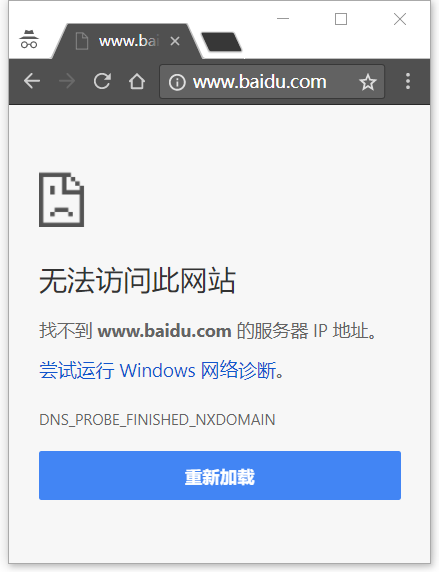

## DNS 域名系统是什么
DNS（Domain Name System，域名系统），万维网上作为域名和IP地址相互映射的一个分布式数据库，能够使用户更方便的访问互联网，而不用去记住能够被机器直接读取的IP数串。通过域名，最终得到该域名对应的IP地址的过程叫做域名解析（或主机名解析）。

DNS域名解析过程

- 当我们在浏览器中输入www.abc.com时，DNS解析将会有将近10个步骤，这个过程大体大体由一张图可以表示：

- 整个过程大体描述如下，其中前两个步骤是在本机完成的，后8个步骤涉及到真正的域名解析服务器：

1、浏览器会检查缓存中有没有这个域名对应的解析过的IP地址，如果缓存中有，这个解析过程就结束。浏览器缓存域名也是有限制的，不仅浏览器缓存大小有限制，而且缓存的时间也有限制，通常情况下为几分钟到几小时不等，域名被缓存的时间限制可以通过TTL属性来设置。这个缓存时间太长和太短都不太好，如果时间太长，一旦域名被解析到的IP有变化，会导致被客户端缓存的域名无法解析到变化后的IP地址，以致该域名不能正常解析，这段时间内有一部分用户无法访问网站。如果设置时间太短，会导致用户每次访问网站都要重新解析一次域名。

2、如果用户浏览器缓存中没有数据，浏览器会查找操作系统缓存中是否有这个域名对应的DNS解析结果。其实操作系统也有一个域名解析的过程，在Windows中可以通过`C:\Windows\System32\drivers\etc\hosts`文件来设置，在Linux中可以通过`/etc/hosts`文件来设置，用户可以将任何域名解析到任何能够访问的IP地址。例如，我们在测试时可以将一个域名解析到一台测试服务器上，这样不用修改任何代码就能测试到单独服务器上的代码的业务逻辑是否正确。正是因为有这种本地DNS解析的规程，所以有黑客就可能通过修改用户的域名来把特定的域名解析到他指定的IP地址上，导致这些域名被劫持。
- host 文件的书写格式
    ```
    0.0.0.0 www.baidu.com
    ##作用将 域名 WWW.baidu.com 域名的 IP 解析为 0.0.0.0 ，此 IP 为本机地址
    ```
- 上述书写方式将导致我们访问 www.baidu.com 的时候得到
    - 

3、前两个过程无法解析时，就要用到我们网络配置中的"DNS服务器地址"了。操作系统会把这个域名发送给这个LDNS，也就是本地区的域名服务器。这个DNS通常都提供给用户本地互联网接入的一个DNS解析服务，例如用户是在学校接入互联网，那么用户的DNS服务器肯定在学校；如果用户是在小区接入互联网，那么用户的DNS就是再提供接入互联网的应用提供商，即电信或联通，也就是通常说的SPA，那么这个DNS通常也会在用户所在城市的某个角落，不会很远。Windows环境下通过命令行输入ipconfig，Linux环境下通过`cat /etc/resolv.conf`就可以查询配置的DNS服务器了。这个专门的域名解析服务器性能都会很好，它们一般都会缓存域名解析结果，当然缓存时间是受到域名的失效时间控制的。大约80%的域名解析到这里就结束了，所以LDNS主要承担了域名的解析工作。
    - Windows DNS 配置
    - 控制面板 -> 网络和共享中心 -> 更改适配器设置 -> 右击正在使用的本地连接 -> 属性 -> Internet协议4（TCP/IPV4）-> OVER 

4、如果LDNS仍然没有命中，就直接到Root Server域名服务器请求解析

5、根域名服务器返回给本地域名服务器一个所查询的主域名服务器（gTLD Server）地址。gTLD是国际顶级域名服务器，如.com、.cn、.org等，全球只有13台左右

6、本地域名服务器LDNS再向上一步返回的gTLD服务器发送请求

7、接受请求的gTLD服务器查找并返回此域名对应的Name Server域名服务器的地址，这个Name Server通常就是用户注册的域名服务器，例如用户在某个域名服务提供商申请的域名，那么这个域名解析任务就由这个域名提供商的服务器来完成

8、Name Server域名服务器会查询存储的域名和IP的映射关系表，在正常情况下都根据域名得到目标IP地址，连同一个TTL值返回给DNS Server域名服务器

9、返回该域名对应的IP和TTL值，LDNS会缓存这个域名和IP的对应关系，缓存时间由TTL值控制

10、把解析的结果返回给用户，用户根据TTL值缓存在本地系统缓存中，域名解析过程结束

在实际的DNS解析过程中，可能还不止这10步，如Name Server可能有很多级，或者有一个GTM来负载均衡控制，这都有可能会影响域名解析过程。


## Reference 
- [DNS域名解析过程](https://blog.csdn.net/zhangyuan19880606/article/details/51141610)
