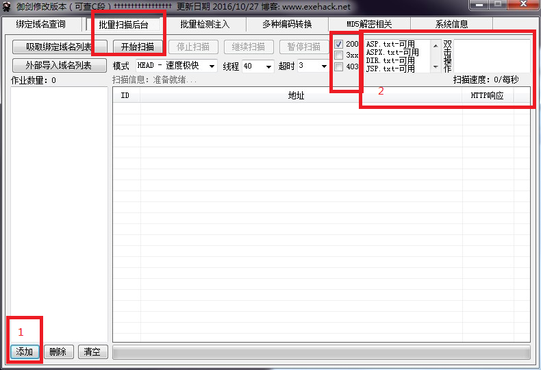

# 使用御剑进行扫描
管理后台也是 web 页面，御剑做的事情是根据一个给定的 URL 以及御剑自身携带的 payload 进行拼接并逐个访问。
- 御剑关于管理后台的扫描是否做了更多的事情暂不能猜到

这件事按照现在的理解只要有 payload 用 BurpSuite 也可以做。

说到底靠猜。

## 下载
1. 链接：https://pan.baidu.com/s/1slkewyD 密码：3mfs
2. 链接：https://pan.baidu.com/s/1nuPTK1r 密码：eobd

## 扫描管理后台

- 