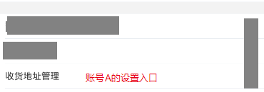

## 一、 什么是越权？
 一个账户做了超过本账户权限之内的事情，我们称之为越权。

## 二、 越权测试需要什么？
1. 两个账号 _我们是出于测试的目的所以需要两个账号，如果是攻击我们只需要一个账号，详情请看下文_
2. 抓包工具
3. 当然了你还需要一个不出故障的饭碗，我的碗就不行老出毛病——__嘿~发牢骚的那个，你别走，保证不打你。 逃__
4. 手机 _这里我用模拟器代替了_

## 三、 测试步骤

### 3.1、观察数据(初始化一个数据)
1. 首先我们需要观察通信过程中的信息交换__身份认证是我们关注的重点。__   
2. 
3. 
### 3.2、观察通信

