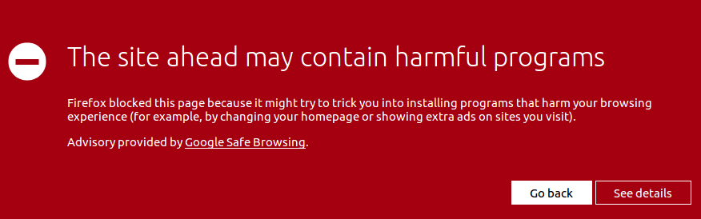
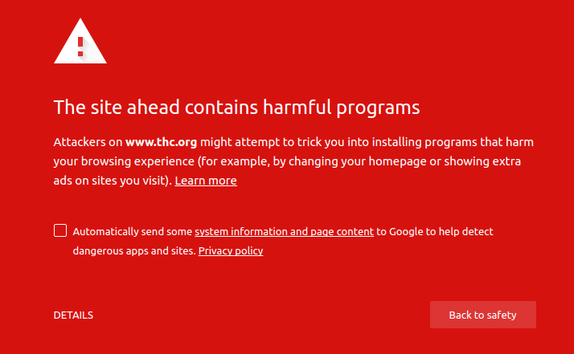

# The site ahead contains harmful programs

最近使用 Firefox 和 Chrome 浏览器访问一些网站的时候提示有风险：
1. Firefox
    - 
2. Chrome
    - 

## 一、我们的目标
1. 接受浏览器给出的风险提示。
2. 同时也要有选择权：“我知道存在风险”
    1. 离开该网页规避该风险
    2. 甘冒风险

### 1.1、Chrome

#### 方法一：
1. Click “`DETAILS`”
2. Click “`visit this site`”

#### 方法二(不推荐)：
Settings 中搜索 `Protect you and your device from dangerous sites` 并且关闭该开关。

这种做法会使我们彻底失去保护，Chrome 将不在进行风险检查，我们讲收到流氓脚本的骚扰。这不符合我们的目标

### 2.1、Firefox
#### 方法一：
1. Click “`See details`”
2. Click “`ignore the risk`”

#### 方法二(不推荐)：
- Preference
    - Privacy & Security
        - Security
            - Deceptive Content and Dangerous Software Protection(拦截危险与欺诈性内容)
                - [√]Block dangerous and deceptive content(封锁危险于欺诈性的内容)
                    - [√]Block dangerous downloads(拦截危险的下载项)
                    - [√]Warn you about unwanted and uncommon software(发现垃圾软件或罕见软件时警告你)

取消上述勾选即可

## 二、造成上述问题的原因
1. 当前看到英文内容的条件反射是：我操，英语
2. 要改进这个问题我们需要把反射调整成：
    - 当看到英文内容时：哎？这是说什么呢？

## Reference
1. https://tehnoblog.org/how-to-fix-the-site-ahead-contains-harmful-programs-message/
2. https://support.mozilla.org/zh-CN/kb/how-does-phishing-and-malware-protection-work