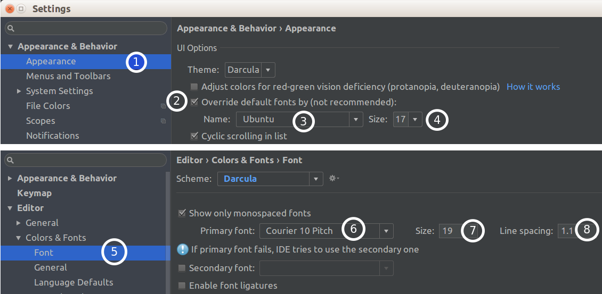

上午11:49	Emulator: [140595460376384]:ERROR:./android/qt/qt_setup.cpp:28:Qt library not found at /beyourself/DevTool/DevKit/Sdk/emulator/lib64/qt/lib

上午11:49	Emulator: Could not launch '/beyourself/DevTool/DevKit/Sdk/emulator/qemu/linux-x86_64/qemu-system-i386': No such file or directory

上午11:49	Emulator: Process finished with exit code 2

**解决** 
- https://askubuntu.com/questions/892863/library-not-found-in-android-studio/892868

Settings -> Android SDK -> SDK Tools
- Android Emulator
- Android SDK Plateform-tools
- Android SDK Tools

## Android Studio 中文乱码
我的乱码是出现在当查看方法注释(Ctrl+Q)的时候。

- 

上图中 ③ 代表 AndroidStudio 中的控制窗口中的字体(例如 File 按钮的字体)。

⑥ 代表编辑器窗口中文字的字体，就是我们写字(code)的字体。

在有乱码的时候 ② 并未选中
- 并非选中 ② 就可以避免乱码，当我选中 ② 的时候
    - 如果 ④ 大于 17 就会是乱码

## Ubuntu AndroidStudio 失去相应
杀死该进程，进程名叫做 java 。