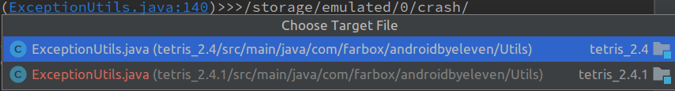
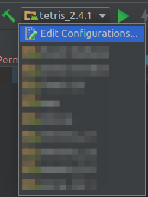

两个项目存在相同的目录结构存在相同的文件，存在相同的代码的时候，在控制台出现指向文件中特定行的链接的时候会出现：
- 

其实是可以忍的，但是觉得有点烦，于是要删除其中一个 moudle (但是不物理删除)，后来发现 TMD 这并不能解决问题，即使不是一个 Moudel 依然会弹出选择框。

**但是现在要说的是删除一个 Moudel 后如何在添加回来？**
- 删除 Moudle 的步骤
    1. File > Project Structure > 红色减号
    2. 
    3. 删除刚刚一处的 Moudle

- 添加刚删除的 moudle 回来
    1. File > New > Import project…