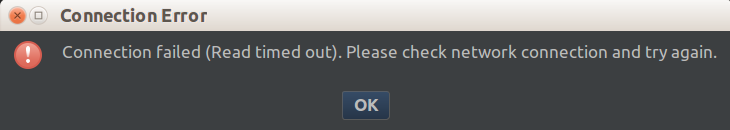

## 一、 AndroidStudio IDEA plagin 
在这里可以找到：https://plugins.jetbrains.com/

## 二、 UML 插件安装
https://plugins.jetbrains.com/，到改网站下载插件 .jar 放到 AndroidStudio 目录中的 plugin 目录下 AndroidStudio > Settings > plugin 安装然后重启

## 三、 AndroidStudio 手动安装插件
我们手动安装插件的时候需要告知 studio 我们的插件路径。

studio 会把插件放到 `~/.AndroidStudio3.0/config/plugins`  目录下,也就是说当一次性的指定好了插件，那个插件文件即可删除了。

## 四、 AndroidStudio 检查更新失败
>当前 AndroidStudio 版本 `3.0`

这和安装插件的时候连接失败是一件事情。 
- 

- 在 Setting > updates 取消勾选 `User secure connection` 成功解决问题。