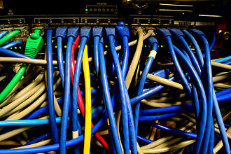

## 〇、 问题
1. DNS 解析速度
2. 域名备案相关问题
    - 使用 GITHUB page 是无需备案的
3. 域名注册提交的信息保密问题
    - 注册信息是政府部门要求强制填写的详细信息。
    - 注册后可修改，这样保密服务可不必购买
    - 默认提供隐私保护
        - (万网)隐私保护服务好像是骗人的业务。
            - 因为****原因，该服务不可用 -_<
4. 域名注册提交的信息是否可修改
    - 注册后可修改
        - 有人说修改难度大，待确认。
5. 什么是域名转入转出
6. 购买了顶级域名如何使用其子域名。


## 一、 关于域名的一点说明
域名的存在是为了解决人们记不住一串数字(IP)这个问题。

域名与 IP 存储在域名服务商的 DNS(Domain Name System) 服务器上。
- 我们访问域名实际上是先访问 DNS 服务器(从DNS服务器得到域名对应的IP)，然后在访问域名对应的IP。
    - 这个流程的细节暂不做表述。

## 二、 域名×商业
DNS 服务器可以自行架设，DNS 服务器的运行与维护需要成本。因此我们从域名服务商处注册、使用域名是需要付费的。
- 关于自行架设 DNS 服务器的技术细节与费用产生情况暂不做表述。

### 2.1、 域名服务商/域名注册商(domain name registrar)
**域名服务商：** 域名注册商（英语：domain name registrar）是一个商业实体或组织，它们由互联网名称与数字地址分配机构（ICANN）或者一个国家性的国家代码顶级域名（ccTLD）域名注册局委派，以在指定的域名注册数据库中管理互联网域名，向公众提供此类服务。并负责提供DNS解析、域名变更过户、域名续费等操作。

ICANN 与 CNNIC 的关系

#### 2.1.1、 关于 ICANN


**ICANN （Internet Corporation for Assigned Names and Numbers）** 互联网名称与数字地址分配机构（Internet Corporation for Assigned Names and Numbers），简称ICANN，是位于美国加利福尼亚的非营利社团，主要由互联网协会的成员组成，创建于1998年9月18日，目的是接管包括管理域名和IP地址的分配等与互联网相关的任务，这些任务曾由其它组织（特别是IANA）代表美国政府来执行，但ICANN仍受美国政府及法律管理。

2016年10月1日美国商务部下属国家电讯局 （NTIA）把域名系统（Domain Name System，DNS）管理权正式移交。这标志着作为世人日常生活一部分的互联网迈出走向全球治理的象征性举动[1]。进入全球“多方利益攸关”（Multi-stakeholder）模式时代。


### 2.2、 域名 > 分类 & 分类标准
国际域名

地理域名

一(二/三)级域名

……

## 三、 关于 IP 

### 3.1、 _网络基础设施_(本节可略过不看，如果需要再回来)

#### 3.1.1、 集线器
**集线器** （Ethernet hub）是指将多条以太网双绞线或光纤集合连接在同一段物理介质下的设备。集线器是运作在OSI模型中的物理层[1]，可以让其连结的设备工作在同一网段。集线器上有多个I/O端口，信号从任意一个端口进入后，会从其他端口出现。
- 集线器只能以半双工模式工作。
- 集线器这个物理设备中不存储数据，只做数据转发。
- 
    - _这是集线器_

#### 3.1.2、 交换机
**网络交换机**（英语：Network switch）是一个扩大网络的器材，能为子网中提供更多的连接端口，以便连接更多的电脑。

-   
    - _关于交换机(Switch)的图片 × 3_

- **二层交换机** 二层交换机工作于OSI参考模型的第二层，即数据链路层。交换机内部的CPU会在每个端口(端口即‘硬件’插口)成功连接时，通过将MAC地址和端口对应，形成一张MAC表。在今后的通讯中，发往该MAC地址的数据包将仅送往其对应的端口，而不是所有的端口。
    - 这里所说的端口指的是物理上的插口。
    - 交换机这个物理物理设备中存储着计算机网卡的MAC地址(网卡的全球唯一编号)，并且有一个 `MAC地址-端口(即插口)` 对应关系的数据结构。
- **三/四/七层交换机** 略

#### 3.1.3、 路由器
**路由**（routing）就是通过互联的网络把信息从源地址传输到目的地址的活动。路由发生在OSI网络参考模型中的第三层即网络层。
- 路由引导数据包(数据包又称分组)转送，经过一些中间的节点后，到它们最后的目的地。作成硬件的话，则称为路由器。路由通常根据路由表——一个存储到各个目的地的最佳路径的表——来引导分组转送。因此为了有效率的转送分组，创建存储在路由器存储器内的路由表是非常重要的。
    - 关于`分组传送`、[`分组交换`](https://zh.wikipedia.org/wiki/分组交换)、`分组交换网`。中所提到的 `分组` 二字 指的是：
        - **数据包**（英语：Data packet），又称分组，是在分组交换网络中传输的格式化数据单位。
- 关于路由表：较小的网络通常可以手动设置路由表，但较大且拥有复杂拓扑的网络可能常常变化，若要手动创建路由表是不切实际的。
    - 动态路由目前主宰了整个互联网。然而，设置路由协议常须要经验与技术；目前的网络技术还没有发展到能够全自动地设置路由。
    - 关于路由表的生成算法：略。

**路由器**（英语：Router，又称路径器）是一种电讯网络设备，提供路由与转送两种重要机制，可以决定数据包从来源端到目的端所经过的路由路径（host到host之间的传输路径），这个过程称为路由；将路由器输入端的数据包移送至适当的路由器输出端（在路由器内部进行），这称为转送。路由工作在OSI模型的第三层——即网络层，例如网际协议（IP）。
- 只要安装相关的软件，使普通的电脑也可以变成路由器。
- 尽管也有其它一些很少用到的被路由协议，但路由通常指的就是IP路由。
- 路由器这个物理设备中存储的就是路由表数据。我们不表述路由表是什么数据结构给出网络上找到的一个例子(路由器的一次数据转发流程)：
    ```例子
    （ 1 ）工作站 A 将工作站 B 的地址 12.0.0 .5 连同数据信息以数据帧的形式发送给路由器 1 。　 
    （ 2 ）路由器 1 收到工作站 A 的数据帧后，先从报头中取出地址 12.0.0 .5 ，并根据路径表计算出发往工作站 B 的最佳路径： R1->R2->R5->B ；并将数据帧发往路由器 2 。
            //路由器 2 的地址就是所谓的下一跳地址。　 
    （ 3 ）路由器 2 重复路由器 1 的工作，并将数据帧转发给路由器 5 。　 
    （ 4 ）路由器 5 同样取出目的地址，发现 12.0.0 .5 就在该路由器所连接的网段上，于是将该数据帧直接交给工作站 B 。　 
    （ 5 ）工作站 B 收到工作站 A 的数据帧，一次通信过程宣告结束。
    ```

#### 3.1.4、 比较
**集线器**集线器相比于交换机更为简单，它可以被视作有多个端口的中继器，从一个端口接受比特位（或符号），再从其他端口提交。它对物理层数据包有所感知，可以检测到其开始、挂起及冲突。在检测到冲突时会发送拥塞信号以传播这一事件。集线器不能对经过它的网络流量做更进一步地检查与管理：任何进入的数据包都会被广播到其他端口。集线器/中继器无法储存数据——数据包必须在接收时被发送，一旦发生冲突，就会丢包（发送端应当能够侦测到，并重新发送）。基于此，集线器只能以半双工模式工作。因此，由于冲突域更广，相比于使用更复杂的网络设备，使用集线器的数据网络更容易出现数据包冲突。
- 所谓冲突域，指的是连接在路由器上的所有的设备，这些设备所组成的这个范围称之为"域"。
- 所谓冲突域，指的是可以进行相互通信的两个或多个物理插口(端口)所组成的范围，针对集线器，就是所有插口(端口)。

##### 二层交换机与集线器的区别
交换机与集线器不同之处是，集线器会将网络内某一用户发送的数据包传至所有已连接到集线器的电脑。而交换机则只会将数据包发送到指定目的地的电脑（透过MAC表），相对上能减少数据碰撞及数据被窃听的机会。交换机更能将同时传到的数据包分别处理，而集线器则不能。

##### 二层交换机与路由器的区别
从时间线上看，路由器诞生于交换机之后，为了弥补交换机不能定向转发数据包的缺陷。

1.两者工作在OSI模型的不同层次上
- 交换机工作在OSI模型第二层数据链路层，路由器工作在OSI模型第三层网络层。网络层提供更多的协议信息，方便路由器做出更加智能的转发选择。

2.两者转发时所依据的对象不同
- 交换机是基于MAC地址识别，实现封装数据包转发。路由器基于网络ID号（IP地址）。MAC一般被固化在网卡中，不可更改。而IP地址可以被系统或网络管理员进行设置和分配。

3.两者转发广播数据包的域不同
- 被交换机连接起来的网络属于同一广播域，广播数据包会在网络内所有网段上进行传播。连接在路由器上的网段则被分区为不同广播域，广播数据包只在各自广播域内传播而无法穿透路由器。路由器的这种子网隔离功能可以在一定程度上防止广播风暴。
- 当路由器接收到的数据无法找到匹配的目的地址(目的IP),该数据包会被丢弃
- 当路由器接收到含有未知 MAC 地址的数据包，会将该数据包发送到所有的端口(插口)，并根据不同端口的反馈“学习”到针对该 MAC 地址的正确端口(插口)，然后将该`端口:MAC地址`对应关系记录到 MAC 表中。


### 3.×、 计算机网络` 与 `IP地址
将计算机通过物理的方式连接起来并不能达到资源共享(通信)的目的，要完成这一目的，相连接的计算机上还应该有用于交换信息的软件才行。

### 3.××、 讲真
我吧 3.1 节搞清楚之后都不知道关于 IP 这一节我想问的问题是什么了，下次我们应该先列一个大纲(随时向大纲的节点中添加我们不断迸发出的问题与观点)然后再篆文。

### 纲
1. IP地址管理机构


## 参考
1. 阮一峰
    - http://www.ruanyifeng.com/blog/2018/05/root-domain.html
    - 
2. [域名系统](https://zh.wikipedia.org/wiki/域名系统)
    - [域名](https://zh.wikipedia.org/wiki/域名)
3. [域名注册商](https://baike.baidu.com/item/域名注册商)
4. [集线器](https://zh.wikipedia.org/wiki/集線器)
5. [双工](https://zh.wikipedia.org/wiki/雙工)
6. [路由器](https://zh.wikipedia.org/wiki/路由器)
    - [路由](https://zh.wikipedia.org/wiki/路由)
7. [交换机](https://zh.wikipedia.org/wiki/網路交換器)
8. [分组交换](https://zh.wikipedia.org/wiki/分组交换)
    - [分组](https://zh.wikipedia.org/wiki/分组)
9. [网际协议](https://zh.wikipedia.org/wiki/网际协议)
10. [交换机 路由器的工作过程及原理](http://www.voidcn.com/article/p-rrdvufmi-bgz.html)
11. [下一跳](https://baike.baidu.com/item/下一跳)
12. [4家外国支持支付宝支付的域名注册商](https://blog.csdn.net/zhaoerduo/article/details/51198966)